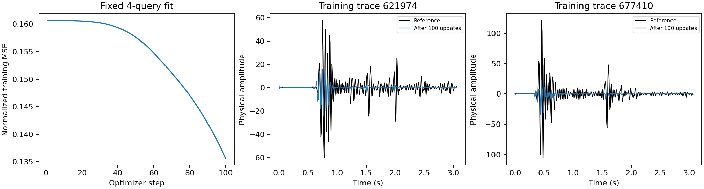

# C3元SEG-Yの異常振幅追跡とQC・正規化の検証（2026-09-08）

極端な振幅は、ヘッダが宣言するIBM形式で元SEG-Yを独立に復号しても再現した。
対象はFFID 1746の437本で、既存readerやinterim生成が新たに作った値ではなかった。
過去のStudy 016ではこのブロックをQC対象としていたが、Study 027のunfiltered契約では
振幅フィルタを使わず、有限値だけの検査を通過していた。

[Study 029](../studies/study_029_c3_amplitude_qc/README.md)では、新しいQC済みsuiteを生成し、
元のraw/interim・固定Study 027・Study 028の初回結果を保持した。
全trainの固定RMSは4.1921×10^34から28.6279になり、正規化後の数値検査は合格した。
固定4本・100更新のCPU診断では、物理RMSEが11.4754から10.5172へ下がった。

## 元SEG-Yとの照合

元ファイルは`SEG_C3NA_ffid_1201-2400.sgy`。binary headerはbig-endian、sample format 1、
625 sample、8000 μs、extended textual header 0を宣言している。
SEG-Yのformat 1はIBM floating pointである。
[SEG-Y rev1仕様](https://seg.org/wp-content/uploads/2025/11/seg_y_rev1.pdf)に基づく独立復号と、
既存reader・segyio・interimを照合した。

| array row | file trace index（0始まり） | sample（0始まり） | file byte offset（0始まり） | raw 4 bytes | 復号振幅 |
|---:|---:|---:|---:|---|---:|
| 835979 | 261051 | 119 | 715284056 | `60ff7f01` | 3.3961×10^38 |
| 836081 | 261153 | 128 | 715563572 | `60ff7f01` | 3.3961×10^38 |
| 836371 | 261443 | 107 | 716358088 | `dc10001e` | −3.2453×10^32 |

上表の振幅だけを表示丸めした。exact値・source/receiver座標・全照合sampleは
[raw監査](../results/study_029_c3_amplitude_qc/20260908T235427220578Z_1819109f28e1_amplitude_qc_summary/raw_segy_audit.json)に保存した。FFID 1742–1750の4,896本を全625 sampleで
照合し、極端値はFFID 1746に局在した。独立IBM復号とsegyioとの差159 sampleは
絶対値5.88×10^-39以下のsubnormalをsigned zeroへ丸める差で、巨大振幅の原因ではない。

FFID 1746の全544本は、107本の全ゼロと437本の過大振幅からなる。
非ゼロtraceの最小peakは115210.0で、10000を超えるsampleは全625範囲で2690個だった。
同じ4 bytesが離れたsample位置に繰り返す疎なパターンもある。
隣接FFID 1745・1747とtrace identification、gain、weighting、delayの値は同じで、
特別なtest patternを示すheaderは見つからなかった。
ただし、これだけで元の生成障害や意図的なパターンのどちらかに断定はできない。

1,579,602,640 bytesの元ファイルを新たに全hash計算し、ダウンロード時のlock、
interimのsource metadataとSHA256が厳密に一致した：
`50c4ea99349375fb8b0a400ec860b16db82583e3eb132accd405c42f266099c7`。
配布元S3の当該FFIDだけを取得するRange要求はHTTP 403となり、bodyは取得していない。
現在のリモート配布物との一致まで確認したものではない。
[取得試行の記録](../results/study_029_c3_amplitude_qc/20260908T235427220578Z_1819109f28e1_amplitude_qc_summary/remote_range_audit.json)を保持する。

## QCと固定入力

閾値は[Study 016の既存判断](../studies/study_016_all_ffid_siren/decisions.md)から10000を採用した。
この値は通常traceの最大4298.765625と、異常traceの最小peak115210の間にあり、
今回のvalidation/testスコアから調整していない。
元traceの625 sampleのいずれかで絶対値が上限を超えれば、trace全体を除外する。
値のクリッピングや別波形による置換はしない。

`exclude_all_zero: false`とし、学習時間`[0,384)`で全ゼロの1195本をすべて保持した。
これには元の625 sampleも全ゼロであるFFID 1746の107本が含まれる。
ゼロ値を振幅だけで欠測扱いしない方針であり、この107本の物理的妥当性を証明したわけではない。

| 項目 | 旧Study 027 | QC済みStudy 029 |
|---|---:|---:|
| canonical train trace | 1,146,803 | 1,146,366 |
| train sample（384 sample/trace） | 440,372,352 | 440,204,544 |
| 今回の除外 | — | FFID 1746の437本 |
| validation crop trace | 73,728 | 73,728 |
| validation 80% target trace | 58,999 | 58,999 |

[新旧suiteの独立比較](../results/study_029_c3_amplitude_qc/20260908T235427220578Z_1819109f28e1_amplitude_qc_summary/suite_comparison.json)では、全20caseのID・順序・recipe・
実現欠損数・全partition mask表・crop volume index・held-out splitが一致した。
train→excludedへ変わった437行以外の行は同じで、physical cellのalias昇格もない。
全20caseの生成・比較は入力契約の確認であり、20caseのモデル実験ではない。

新suiteのSHA256は`f707a2e09dc0c0c2e137c1c2aef3ed57ade7bf8a3f05e9b784f531d70ed3a3ee`。
旧suiteのSHA256は`6447a35cc7d4de43532ee8e2e0de3245ac0e93d855efa7ff59c98a85e1631cab`を維持した。
新partitionとnormalizationに結びつくcase/mask/volume JSONのhashは変わるため、
旧checkpointのbindingをそのまま新suiteへ流用しない。

## 正規化と局所学習

GNNのglobal RMSは、QC後のcanonical train・time`[0,384)`から従来どおりfloat64で求めた。
robust RMSやper-trace尺度には変更していない。通常学習と両preflightでは、
`training_data.max_abs_amplitude: 10000.0`をfit前に検査する。
旧poolを与えるとarray row 835928・sample 116でエラーになり、学習を開始しない。

[数値検査](../results/study_029_c3_amplitude_qc/20260908T235427220578Z_1819109f28e1_amplitude_qc_summary/normalization.json)は、許可されたtrain行・時間だけを読み、
実readerと同じfloat64除算→float32変換→float32二乗を確認した。

| 項目 | 旧条件 | QC後 |
|---|---:|---:|
| 固定RMS | 4.1921×10^34 | 28.6279 |
| 正規化後の正値trace RMS中央値（尺度による換算） | 2.1432×10^-34 | 0.3138 |
| 非ゼロsampleがfloat32変換でゼロ化 | 4,296,712 | 0 |
| 非ゼロtraceのfloat32二乗エネルギー全消失 | 1,145,210 | 0 |
| 正規化後の非有限sample | 0 | 0 |
| float32二乗エネルギーの非有限trace | 0 | 0 |

同じfresh encoderへ物理振幅1・10・1000の定数波形を入れると、旧尺度では3例すべて
ゼロ入力とbitwise一致したが、QC後はすべて異なる出力になった。
通常振幅の入力差が数値表現に残ることを確認できた。

[CPU学習診断](../results/study_029_c3_amplitude_qc/20260908T235427220578Z_1819109f28e1_amplitude_qc_summary/training_probe.json)はseed20260908、width32、各relation2近傍、
27,333 parameter、AdamW lr0.0001を使い、最初のtrain episodeの先頭4 hidden query
`621974,677410,803370,886571`を100回更新した。教師・supportはtrain内に限定し、
評価用のvalidation/test波形は読んでいない。既存checkpointも再利用していない。

| 4本の訓練波形に対する指標 | 初期 | 100更新後 |
|---|---:|---:|
| 物理RMSE | 11.4754 | 10.5172 |
| 物理SNR (dB) | 0.0000 | 0.7573 |

誤差は下がったが、波形の復元はまだ不十分である。同じ4本を繰り返す局所診断なので、
未観測queryへの汎化や全volumeのSNR改善は未検証である。初回GNNの−567.8483 dBは
別のvalidation全volume指標であり、この0.7573 dBとの直接比較はしない。
旧実験のprocess間厳密一致検査の未達も、この診断によって解消されたとは扱わない。

実装・テスト・研究設定は現在の作業ツリーにあり、runのGit SHAはベースcommitを表す。
元runを編集せず、採用した小さい監査・図・source hashは
[manifest](../results/study_029_c3_amplitude_qc/20260908T235427220578Z_1819109f28e1_amplitude_qc_summary/manifest.json)に記録した。環境固有の絶対pathは公開用コピーで相対化した。
