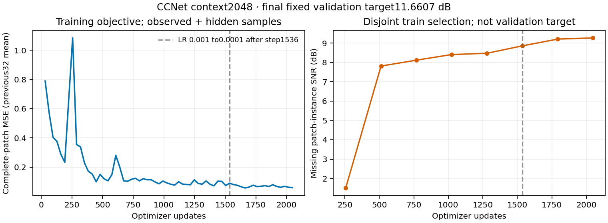
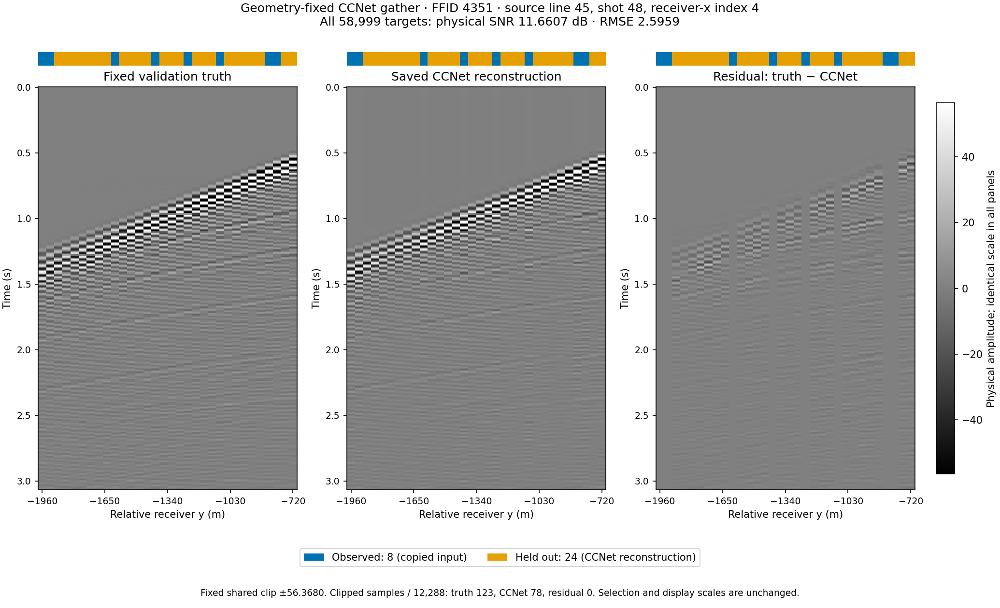
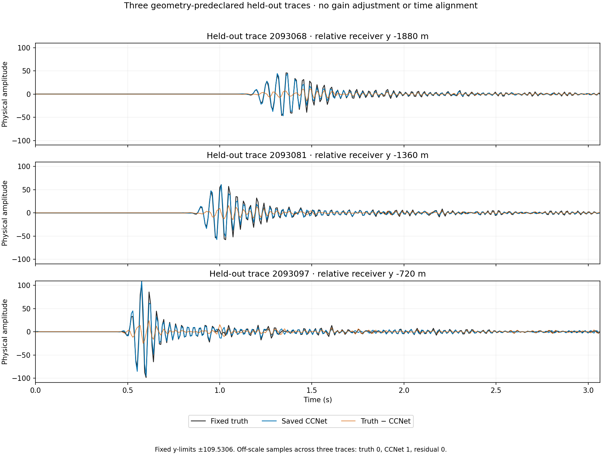

# C3 CCNet5D: 広いパッチ・2,048 更新の採用結果（2026-09-09）

固定 QC validation の全 **58,999 本 × 384 samples = 22,655,616 samples** で、CCNet5D の final 2,048 更新は物理 **SNR 11.6607 dB、RMSE 2.5959** となった。全対象保存予測の独立再採点と固定 CPU 復元監査が合格し、この条件での 10 dB 目標を達成した研究モデルとして採用する。固定 shear は使用していない。[採用判断](../results/study_033_c3_ccnet_10db/20260909T131648444680Z_f2dccac6d1e3_context_2048_publication/adoption_decision.json) は checkpoint・保存予測・監査のパスと SHA を固定している。重みと全予測配列は元 `runs/` に保持した。

評価は validation random trace 80% 欠測、seed 142、物理振幅で、観測 14,729 本を入力とする。437 本の異常振幅を除いた Study029 の train pool を使用し、正常な全ゼロ 1,195 本は保持した。CCNet の教師と正規化は train partition 内で完結し、validation target 真値は採点・可視化にのみ用いた。test は未使用であり、単一の固定 validation 条件を超える汎化を確認した結果ではない。

| 完了条件 | 全 target SNR (dB) | 全 target RMSE | 観測再挿入前のモデル RMSE | train 内部選択 SNR (dB) |
|---|---:|---:|---:|---:|
| QC baseline・128 更新 | −0.0027 | 9.9417 | 9.9443 | −0.0053 |
| 広いパッチ・final 2,048 更新 | **11.6607** | **2.5959** | 2.1303 | 9.2691 |

全 target の reference energy は **2.2378×10⁹**、error energy は **1.5267×10⁸**。表は丸め値で、[全精度の summary](../results/study_033_c3_ccnet_10db/20260909T131648444680Z_f2dccac6d1e3_context_2048_publication/summary.json) が正本である。内部選択は train partition 内の別領域から取ったパッチ欠測点の指標であり、validation target の 11.6607 dB と同じ評価領域ではない。best と final はどちらも 8 epochs・2,048 更新で、主評価には final checkpoint を明示して一回の凍結予測を使った。

モデルは **111,969 parameters**、H/R=32、kernel 3、4 段の Conv3D/Conv2D、符号を保持する最終 linear 出力である。これは幅・kernel・最終出力を調整した CCNet5D 変更版で、原論文設定の完全再現とは扱わない。パッチは軸順 `[time, source-line, shot, receiver-x, receiver-y]` で **[64,8,16,8,16]**。fit 512 個、内部選択 32 個を固定し、80% trace mask、seed 20260908、batch 2、Adam 1×10⁻³ で fresh 初期化から 8 epochs 学習した。6 epochs 終了後、step 1,536 の次から学習率を 1×10⁻⁴ に下げた。損失は観測・欠測を含む完全パッチ MSE で、fit 領域だけから求めた global RMS **8.3516** を使う。

fit / selection は、波形を見る前に固定した shot `32:48` / `48:64` の互いに重ならない領域で、各 32,768 本、shape `[384,8,16,8,32]`。すべて QC train pool に属し、除外 437 本との重複はない。領域の energy とパッチ境界の診断は [baseline 調査報告](c3_ccnet_investigation_20260909.md) にまとめた。kernel 3 を 4 段積んだ理論受容野は各軸 9 samples のままで、パッチ拡大により shot・receiver-y 方向で実データだけを参照できる内部位置を増やしている。source-line と receiver-x の辺長 8 は依然 9 未満である。

baseline からは領域、幅、パッチ、descriptor 数、batch、更新数、学習率、学習 backend、予測 core を合わせて変更した。損失へ延べ提示した点数は **4,294,967,296 samples** で、baseline の 524,288 samples の **8,192 倍**。内訳は更新 16 倍 × batch 2 倍 × パッチ点数 256 倍である。観測点と重複パッチを含む提示量で、unique coverage ではない。この比較からパッチ拡大など単一要因の効果を分離することはできない。

左は直前 32 更新の sample 数で重み付けした平均 MSE、右は 256 更新ごとの train 内部選択 SNR。全学習の累積平均や最終 batch 単独損失ではない。最終区間 MSE は **0.0594** となった。破線は学習率を下げる境界である。

推論は core **[64,9,16,8,16]**、halo 4、全 24 タイルで行った。volume 境界で切り詰めた実際の最大入力は **[72,9,20,8,20]**。観測は推論後に厳密に再挿入し、最大差は 0、未被覆点は 0 だった。[独立監査](../runs/study_033_c3_ccnet_10db/20260909T130443471844Z_5df55f375e66_context_2048_completion_handoff/verification/result.json) は全 target の float64 再採点を native の全指標と完全一致させ、入力・checkpoint role・更新数・パッチ計画の対応も検証した。

CPU 復元は CPU forward 前に幾何・設定だけから固定した native tiles **0 / 12 / 23** の全入力を使い、欠測 core の **2,838,720 samples** を保存予測と照合した。normalized 差 RMSE **1.5475×10⁻⁷**、最大差 **2.0554×10⁻⁶**、physical relative L2 **4.3232×10⁻⁷** は、固定閾値 **1×10⁻⁴ / 1×10⁻³ / 1×10⁻³** をすべて満たした。energy の追加照合は `rtol=1e-6, atol=1e-12`。CPU forward は target 真値を読まず、checkpoint の fit RMS を使う。これは固定タイルの工程監査であり、全 target を CPU で bitwise 復元したという意味ではない。

学習・予測の起動時は TF32 の両 override を 0 とし、native は float32 matmul `highest`、matmul TF32 false、cuDNN benchmark false を記録した。cuDNN TF32 フラグ自体は true、deterministic フラグは false の記録を保持しており、全演算の bitwise 決定性を主張しない。H100 NVL の cuda:0、CPU 1 thread で、native 学習＋内部選択 **580.4847 秒**、予測 **2.3190 秒**。外側 action の経過時間は **613.5985 / 13.4135 秒**で、入力検証等を含む。native peak allocated は学習 **4.4728 GB**、予測 **1.0824 GB**。これらは各 native process の記録であり、モデル forward 単独の所要時間や他手法と等しい計測範囲ではない。

訓練時の Git 記録は `5df55f3`・dirty のまま保存し、native の nonformal 注意書きも消していない。一方、使用した **183 source files は公開 commit `f2dccac` と全 byte 一致**することを [対応記録](../runs/study_033_c3_ccnet_10db/20260909T130443471844Z_5df55f375e66_context_2048_completion_handoff/source_publication_commit.json) で確認した。採用はこの凍結 source と全件監査に基づく研究判断であり、訓練時に clean worktree だったという記録への置換ではない。

source-line 45、shot 48、receiver-x index 4、FFID 4351 の 32 本（観測 8・target 24）。幾何と表示範囲は候補完了前に宣言し、既に保存してある同じ断面の真値 CSV を再利用した。3 パネルは共通 **±56.3680**、clip 点数は truth 123、CCNet 78、residual 0（各 12,288 samples）。断面は主要な傾斜イベントを再構成する一方、欠測位置の振幅・波形残差が残る。表示 clip は全対象採点へ適用していない。

対象 ID **2093068 / 2093081 / 2093097** は幾何で事前固定し、良好な予測の選別はしていない。振幅利得や時間の事後調整はなく、全パネル共通の表示範囲は **±109.5306**。最後の trace の CCNet 予測 1 sample だけが表示範囲外にある。図の作成では新たな SEG-Y・振幅源読取やモデル forward を行わず、過去 GNN の再構成値も使っていない。[図の metadata](../results/study_033_c3_ccnet_10db/20260909T131648444680Z_f2dccac6d1e3_context_2048_publication/figure_metadata.json) に選択・尺度・元真値の SHA を保存した。

参考として、同じ全 target の [proposed GNN final 5,000 更新](c3_proposed_gnn_relative_mse_5k_20260909.md) は **11.9354 dB / RMSE 2.5151**、[固定 shear を併用した SIREN 参照](c3_siren_coordinate_investigation_20260909.md) は **11.3422 dB / RMSE 2.6929**。GNN は train pool の隠した query ラベル延べ 640,000 本、245,760,000 samples を使い、SIREN は評価 volume の観測 14,729 本を 5,000 回提示している。CCNet の完全教師パッチとは学習情報・損失・露出が異なり、SIREN には補助変換もある。したがってこの数値差を architecture の優劣とは解釈しない。GNN の reference energy には加算順序による微小差があり、全手法の native energy が bitwise 同一とも主張しない。

[採用 manifest](../results/study_033_c3_ccnet_10db/20260909T131648444680Z_f2dccac6d1e3_context_2048_publication/manifest.json) に元 run と全 artifact の SHA、[検証コマンド記録](../results/study_033_c3_ccnet_10db/20260909T131648444680Z_f2dccac6d1e3_context_2048_publication/verification_commands.json) に実行済みの範囲を保持した。採用図表は新しい解析 run から byte-identical に配置し、元の実験・監査結果は変更していない。
