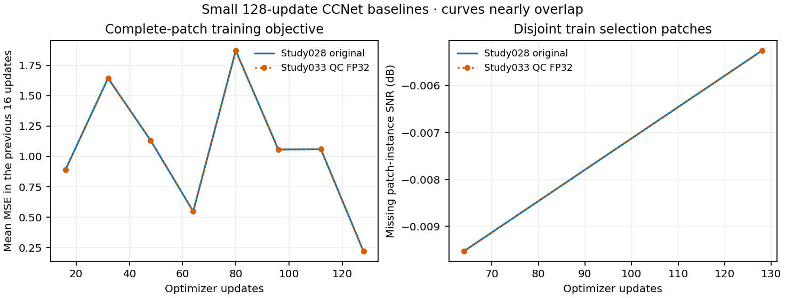
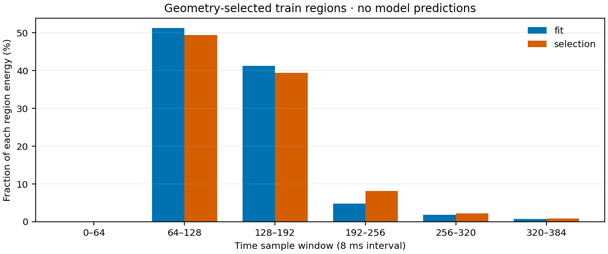

# C3 CCNet5D: QC baseline と訓練領域の診断（2026-09-09）

437 本の異常振幅を除いた固定 QC benchmark で、Study028 と同じ小規模 CCNet を新規学習した。final 128 更新の物理 target SNR は **−0.0027 dB、RMSE は 9.9417** で、10 dB 目標は未達だった。保存予測の全対象再採点と固定 3 タイルの CPU 復元監査は合格した。本報告は baseline と次の訓練領域の診断であり、モデル採用判断ではない。図表は [採用比較図表の manifest](../results/study_033_c3_ccnet_10db/20260909T130454311906Z_5df55f375e66_baseline_diagnostics_publication/manifest.json) に記録し、後続 final 2,048 更新の監査合格後に比較図表として `results/` へ採用した。baseline モデル自体は採用していない。

比較対象は同じ validation random 80% 欠測、seed 142 の **58,999 本 × 384 samples = 22,655,616 samples**。時間間隔は 8 ms、評価振幅は物理単位である。QC は canonical train pool から 437 本を除外し、正常な全ゼロ 1,195 本を保持した。評価 crop・mask・行対応は [Study029 の比較監査](../results/study_029_c3_amplitude_qc/20260908T235427220578Z_1819109f28e1_amplitude_qc_summary/suite_comparison.json) で不変と確認されている。CCNet は train partition 内の完全教師パッチで学習し、別の train 領域で内部選択する。validation target 真値は今回の全対象採点にのみ使い、test は使用していない。

| 条件 | 全 target SNR (dB) | 全 target RMSE | 観測再挿入前のモデル RMSE | 更新数 |
|---|---:|---:|---:|---:|
| Study028 元 baseline | −0.0027 | 9.9417 | 9.9443 | 128 |
| Study033 QC・FP32 baseline | −0.0027 | 9.9417 | 9.9443 | 128 |
| zero fill | 0.0000 | 9.9386 | — | — |

表示値は丸め済みで、QC 後の SNR 差は **+3.9088×10⁻⁶ dB** にとどまる。[全精度の比較表](../results/study_033_c3_ccnet_10db/20260909T130454311906Z_5df55f375e66_baseline_diagnostics_publication/physical_comparison.csv) と元の [Study028 結果](c3_first_results_20260908.md) を参照。baseline の fit 65,536 本・selection 16,384 本は除外された source-line の外側にあり、新旧の領域行対応、fit RMS **8.2957**、固定パッチ計画は一致した。したがって全 train pool の QC が、この CCNet の実効教師波形を改善したという結果ではない。また QC binding に加えて数値設定と物理 GPU も変わるため、純粋な QC 単独比較でもない。

モデルは H/R=8、kernel 3、4 段の Conv3D/Conv2D、7,257 parameters、最終出力は符号を保つ linear とした。[Study025 の仕様整理](../studies/study_025_c3_na_ccnet5d/README.md) に対し、小さい kernel・幅と最終 linear 出力を用いる変更版であり、原論文設定の完全再現ではない。パッチ形状は `[time, source-line, shot, receiver-x, receiver-y]=[32,2,4,2,8]`、fit 64 個・selection 16 個を固定し、80% trace mask、seed 20260908、Adam 1×10⁻⁴、batch 1、2 epochs で学習した。損失は観測と欠測を含む完全パッチの MSE で、fit 領域の global RMS だけを尺度に使う。延べ提示量は 524,288 samples であり、fit 全領域を二巡した量ではない。

青実線が元 baseline、橙点線が QC 後で、曲線はほぼ重なる。左は直前 16 更新の平均 MSE、右は train 内部選択パッチの欠測点 SNR である。右の値は全 validation target の SNR とは異なる。最終区間 MSE は **0.2210**、内部選択 SNR は **−0.0053 dB**。best と final はいずれも 128 更新だった。

QC 後は起動時の `TORCH_ALLOW_TF32_CUBLAS_OVERRIDE=0`、`NVIDIA_TF32_OVERRIDE=0`、native の float32 matmul は `highest`、matmul TF32 は false。native cuDNN TF32 フラグは true と記録され、benchmark は学習 true・予測 false なので、この差も保持している。元 baseline は matmul `high`・TF32 true で、起動時 override の値は記録されていない。GPU は旧 cuda:1 から新 cuda:0 へ変わった。新 baseline の native 学習＋内部選択は **3.1538 秒**、予測は **5.7112 秒**、それぞれの外側 action 全体は **35.0536 / 16.3646 秒**だった。native peak allocated は **0.0110 / 0.1254 GB**。小さい実測条件の値であり、大きいパッチの定常速度への外挿や GPU 間の速度比較には使わない。[段階別の資源記録](../results/study_033_c3_ccnet_10db/20260909T130454311906Z_5df55f375e66_baseline_diagnostics_publication/baseline_summary.json) に元の計測範囲を保持した。

[独立監査](../runs/study_033_c3_ccnet_10db/20260909T130353922748Z_5df55f375e66_qc_baseline_cpu_audit/verification/result.json) は保存予測の全 target 指標を native と完全一致させ、有限値・全域 coverage・観測再挿入の最大差 0 を確認した。CPU 復元は事前固定した native tiles **0 / 288 / 575** の欠測 core **119,872 samples** に対する別の検査で、全 target の CPU bitwise 復元を主張しない。normalized 差 RMSE **5.4090×10⁻⁹**、最大差 **3.4129×10⁻⁸**、physical relative L2 **1.5885×10⁻⁷** は、それぞれ固定閾値 **1×10⁻⁴ / 1×10⁻³ / 1×10⁻³** を満たした。CPU forward は target 真値を読まず、checkpoint の fit RMS を使う。final の role・128 更新・入力とパッチ計画の provenance も照合済みである。native の dirty-worktree/nonformal 注意書きは原記録に保持し、今回の診断を形式上のモデル採用へ読み替えていない。

次の広いパッチを収める候補は、旧 fit を shot 方向に二分した最初の幾何案を採った。波形による領域選別はしていない。両側とも time `0:384`、source-line `0:8`、receiver-x `0:8`、receiver-y `17:49` とし、fit は shot `32:48`、selection は `48:64`。各 **32,768 本 / 12,582,912 samples**、shape `[384,8,16,8,32]` で互いに行重複がなく、全行が QC train pool に含まれ、除外 437 本との重複は 0 だった。領域固定後に train 波形を各一回だけ読んだ [幾何・振幅監査](../runs/study_033_c3_ccnet_10db/20260909T125002842211Z_5df55f375e66_training_region_feasibility/result.json) の結果を示す。

| 候補領域 | RMS | 最大絶対振幅 | sample 64:192 の energy 比率 | 384 samples 全ゼロ本数 |
|---|---:|---:|---:|---:|
| fit | 8.3516 | 97.5667 | 92.5866% | 0 |
| selection | 8.2394 | 96.6102 | 88.8248% | 0 |

sample 64:192、すなわち 0.512–1.536 秒の窓に energy が集中している。最初の 64 samples の比率は fit **8.9058×10⁻⁶%**、selection **8.2811×10⁻⁶%** だが、これを根拠に時間窓の再選別や追加除外はしていない。selection の RMS は診断値で、モデル正規化の推定には使わない。

kernel 3 を 4 段積む現在のモデルは各軸の理論受容野が **9 samples**、halo が 4。時間方向では最初と最後の sample 中心間が **64 ms** である。baseline はすべての空間パッチ辺が 9 未満で、各位置がその軸のパッチ境界の zero padding に接する。候補 `[64,8,16,8,16]` は shot・receiver-y に実データだけの受容野を持つ内部位置を増やせる一方、source-line・receiver-x の 8 は依然 9 未満である。**パッチ拡大自体が理論受容野を拡大するわけではない。** この制約と小さい学習予算は次の条件を調べる根拠であり、低 SNR の原因を確定したものでも CCNet の表現能力を否定するものでもない。広いパッチ・幅 32・2,048 更新候補の予測品質は本報告には含めない。

集計は封印済み JSON/CSV だけから生成し、新たなモデル forward・波形読取は行っていない。各図表の生成元 SHA、全精度の値、既存検証コマンドへの参照は [manifest](../results/study_033_c3_ccnet_10db/20260909T130454311906Z_5df55f375e66_baseline_diagnostics_publication/manifest.json) と [commands.json](../results/study_033_c3_ccnet_10db/20260909T130454311906Z_5df55f375e66_baseline_diagnostics_publication/commands.json) に保存した。
