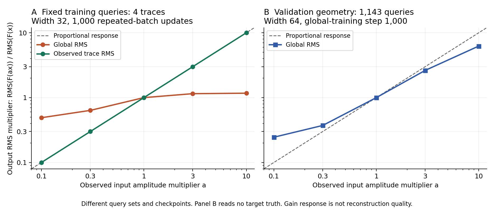

# C3 proposed GNN の振幅分離と倍率応答 — 2026-09-09

**観測trace RMSをモデル内で分離すると、固定訓練4本のfitは20.0908から21.1003 dBへ改善し、入力倍率への比例応答も確認できた。ただし、新モードの全欠測targetに対するモデル品質は未測定である。** 本報告は振幅に関する完了済みCPU診断をまとめる。[従来のbaseline報告](c3_proposed_gnn_investigation_20260909.md)は別に保持する。

全診断の基礎は、異常437本を除いたQC suite（SHA256 `f707a2e09dc0c0c2e137c1c2aef3ed57ade7bf8a3f05e9b784f531d70ed3a3ee`）。固定validation caseは `c3_benchmark_validation_random_trace_80_seed142`、観測14,729本、欠測58,999本×384 samplesである。全train 1,146,366本から既にfitしたglobal RMS28.6279224551を保持し、追加除外やshearは導入していない。

新しい `observed_trace_rms` は、visible mask適用後の入力を各観測traceのRMSで割って既存GNNへ渡す。queryのgainは、そのqueryに直接入る観測senderを関係間で重複除去し、共通距離D0の `1/max(D0,10⁻⁶)²` でRMSを内挿する。2 rounds先のsupport全体や他queryのsender集合はgainに使わない。ゼロ波形はゼロのまま、無近傍queryの出力はゼロである。decoder後にこのgainを一度掛け、pipelineが元のglobal RMSを一度戻す。教師・masked MSEの単位は従来どおりで、教師RMSをモデル入力にはしない。既定の `train_global_rms` は保持している。

| 同一の固定訓練4本・1,000更新（validationではない） | physical SNR (dB) | physical RMSE | CPU条件時間 (s) |
| --- | ---: | ---: | ---: |
| global RMS | 20.0908 | 1.1356 | 89.45 |
| observed trace RMS | 21.1003 | 1.0110 | 89.10 |

seed20260908、幅32・27,333 parameters・2 rounds・各関係近傍2本、AdamW学習率10⁻³、weight decay0、gradient clip1、同じ4 queryを使った。初期weights、126本の観測入力、4本の教師はSHA一致。教師は保存済みのauthorized trainだけを再利用し、validation/test波形は読んでいない。両条件で通常checkpointのCPU復元はbitwise一致した。新条件の全体時間は121.73 s、学習条件時間は上表の値で、GPU未使用・CPU1 threadである。[固定訓練fit CSV](../results/study_032_c3_proposed_gnn_10db/20260909T070951794015Z_e39df16d563c_amplitude_diagnostics_publication/fixed_training_fit.csv)。

入力振幅だけを変え、重み・幾何・mask・global RMSを固定した倍率応答を以下に示す。値は `RMS(F(ax))/RMS(F(x))`。固定4本ではglobal-normalized入力に倍率を掛け、幅64の中間checkpoint診断では物理観測波形に倍率を掛けて通常の入力組み立てを行う。float32丸めの経路は異なる。右列は別の学習条件・query集合なので、固定4本との精度の直接比較ではない。

| 入力倍率a | 固定train4本: global RMS | 固定train4本: observed RMS | step1000: validation位置1,143本・global RMS |
| ---: | ---: | ---: | ---: |
| 0.1 | 0.4902 | 0.1000 | 0.2452 |
| 0.3 | 0.6357 | 0.3000 | 0.3724 |
| 1 | 1.0000 | 1.0000 | 1.0000 |
| 3 | 1.1507 | 3.0000 | 2.6278 |
| 10 | 1.1698 | 10.0000 | 6.2350 |

新モードの固定4本では `F(ax)` と `aF(x)` の最大physical relative L2は5.9814×10⁻⁷、倍率を合わせた訓練教師へのSNRは全倍率で約21.1003 dBだった。幅64・global RMSのstep1000では、最初512・中央512・最後119本のnative batchをCPUで一度ずつ組み立て、3 batch×5倍率の合計15 forwardを行った。target真値は一切読まず、gain応答だけを計測した（52.12 s）。0.1倍と10倍でのrelative L2は2.0351と0.5384で、比例応答からのずれがある。[全15条件のCSV](../results/study_032_c3_proposed_gnn_10db/20260909T070951794015Z_e39df16d563c_amplitude_diagnostics_publication/gain_response.csv)。この診断だけでGroupNormを原因と確定したり、validation品質改善を主張したりはできない。

別の診断では、観測14,729本だけから全58,999 queryのRMSを推定した。近傍2本/関係、radius1、共通D0尺度320 m・320 m、exact indexを使い、**全gainの保存・SHA固定が終わるまでtarget波形を数値読み出ししなかった**。その後だけtarget真値を読み、推定RMSの誤差を採点した。

| 全58,999 targetの振幅だけの診断 | 値 |
| --- | ---: |
| RMS差のRMSE | 0.3605 |
| RMS差のrelative L2 | 0.0363 |
| 絶対相対RMS誤差 median / p95 / p99 | 1.6007% / 8.9315% / 15.0471% |
| 真のunit waveform × 推定RMSのphysical SNR | 28.8088 dB |
| 同physical RMSE | 0.3605 |
| 無近傍 / 真のRMSゼロ / 推定RMSゼロ | 0 / 0 / 0 |

**28.8088 dBはoracleの単位RMS波形を与えて振幅因子の誤差だけを調べた値であり、モデル性能・到達上限・10 dB目標達成ではない。** decoderの出力振幅は固定されておらず、学習波形がgain誤差を補正することもできる。したがってモデルの上限とは扱わない。この診断ではモデルを構築せず、forwardも学習も0回、CPU1 thread・97.05 sだった。target波形は保存済みgainの採点にのみ使用した。[振幅だけの診断CSV](../results/study_032_c3_proposed_gnn_10db/20260909T070951794015Z_e39df16d563c_amplitude_diagnostics_publication/amplitude_only_diagnostic.csv)、[RMS分位点CSV](../results/study_032_c3_proposed_gnn_10db/20260909T070951794015Z_e39df16d563c_amplitude_diagnostics_publication/rms_quantiles.csv)。

集計対象のglobal RMS・幅64・5,000更新runは進行中で、保存したstep1000 `best_validation` checkpointの全target native SNRは2.8512 dB、RMSE7.1575だった。これは**中間指標**であり、finalの完了・独立予測・採用を意味しない。本報告には5,000更新のfinal結果を含めず、新モードの全targetモデル予測も未測定である。

[compact JSON](../results/study_032_c3_proposed_gnn_10db/20260909T070951794015Z_e39df16d563c_amplitude_diagnostics_publication/amplitude_summary.json)は各評価範囲を明記し、[manifest](../results/study_032_c3_proposed_gnn_10db/20260909T070951794015Z_e39df16d563c_amplitude_diagnostics_publication/manifest.json)に元run・script・使用source・checkpoint・配列のrepository相対pathとSHA256を記録した。本文の表は小数4桁へ丸め、数値はCSV/JSONでは丸めず、図は同CSVの値から生成した。成果物は[新しい解析run](../runs/study_032_c3_proposed_gnn_10db/20260909T070951794015Z_e39df16d563c_amplitude_diagnostics_publication/request.json)からbyte-identicalに採用し、元run/resultsや既存報告を変更していない。このpublicationは既存成果物の集計だけで、新しいモデルforward・学習・波形の数値読み出しを行っていない。
