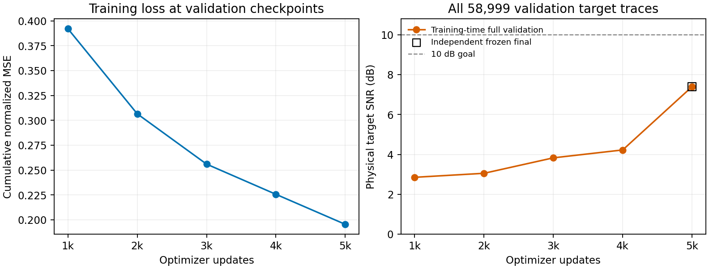

# C3 proposed GNN の global RMS・5,000更新と IDW 比較 — 2026-09-09

**global RMS を使う GNN の独立 frozen 予測は、全欠測 target の物理 SNR 7.4002 dB、RMSE 4.2395だった。200更新 baseline の0.0144 dBから改善したが、10 dB目標は未達であり、モデルは採用しない。** 全対象の保存予測再採点は成功した一方、訓練時と独立予測の誤差エネルギー一致、CPU checkpoint 復元の一部基準は不合格だった。本報告で採用するのは、完了済み実験の調査図表である。以前の[基準結果レポート](c3_proposed_gnn_investigation_20260909.md)と元の run は保持する。

固定 QC suite の validation case `c3_benchmark_validation_random_trace_80_seed142` を使った。観測14,729本に対し、評価は欠測 **58,999本×384 = 22,655,616 samples**、時間0–3.064 sの全対象である。GNN の学習と固定尺度の fit は、異常437本を除外した別の canonical train 1,146,366本の `[0,384)` に限る。global RMS は28.6279。訓練 episode では visible 波形だけを入力し、hidden 波形をラベルとする。validation 推論の入力は観測波形だけで、target 真値は採点にのみ用い、test partition は未使用である。

| 同じ全 validation target の物理評価 | SNR (dB) | RMSE |
| --- | ---: | ---: |
| zero-fill | 0.0000 | 9.9386 |
| GNN・200更新 baseline の独立 final 予測 | 0.0144 | 9.9222 |
| GNN・global RMS・5,000更新の独立 final 予測 | **7.4002** | **4.2395** |
| 観測物理波形の直接 IDW | −0.7444 | 10.8280 |
| 観測 unit 波形の IDW × 観測 RMS の IDW | −0.7434 | 10.8267 |

[物理指標 CSV](../results/study_032_c3_proposed_gnn_10db/20260909T075050439519Z_e39df16d563c_global_rms_5k_publication/physical_comparison.csv)は丸めない値、評価範囲、元記録、監査状態を保持する。[SIREN の11.3422 dB・RMSE 2.6929](../results/study_031_c3_siren_10db/20260909T055026000000Z_e39df16d563c_shear_reference_adoption/adoption_decision.json)は、固定 shear 0.0006 s/mを伴う外部参照である。SIREN は同じ validation crop の観測から学習し、観測だけで尺度と shear を決めた。GNN は別の訓練 partition を使い、shear は使わない。同一の学習情報・同一の前処理での優劣比較とはしない。

5,000更新の GNN は幅64・101,701 parameters、2 rounds、各関係の近傍2本、query batch128、Adam 学習率10⁻³、seed20260908で fresh training した。幾何検索は `exact_index` と同一 observed 集合内の cache を使い、共通距離尺度は320 m・320 m、半径1で固定した。200更新 baseline は幅32・query batch4・学習率10⁻⁴であり、更新数以外にも条件が異なる。改善を一つの設定変更だけの効果とは解釈できない。

実際の訓練 exposure は **640,000 query・245,760,000 samples** だった。最初の人工 mask episode の visible は229,273本、hidden は917,093本で、完了した episode は0、最終 episode は途中終了として記録されている。全訓練 pool を一巡したという意味ではない。検証は1,000更新ごとに全 target へ行い、best と final はともに5,000更新となった。両 checkpoint の重みは一致するが、役割は別に監査した。[訓練指標](../runs/study_032_c3_proposed_gnn_10db/20260909T064032733552Z_e39df16d563c_gnn-train/native/metrics.json)。

左図はその時点までの正規化誤差エネルギーを累積 sample 数で割った訓練 MSEであり、固定訓練集合の再評価や直近 batch の loss ではない。右図の訓練時 validation SNR は2.8512 → 3.0524 → 3.8284 → 4.2245 → 7.4001 dBで、最後に独立 frozen の7.4002 dBを併記した。5,000更新時の累積訓練 MSE は0.1955、最後の batch MSE は0.0334だった。[曲線の CSV](../results/study_032_c3_proposed_gnn_10db/20260909T075050439519Z_e39df16d563c_global_rms_5k_publication/learning_progress.csv)。

IDW は学習なしの別診断である。GNN と同じ幾何設定で、query 自身への4関係の直接 observed sender を重複除去し、共通距離 `D0` に対する `1 / max(D0, 10⁻⁶)²` を正規化して平均した。unit 波形版は各観測波形をその RMS で割ってから IDW し、同じ重みで補間した観測 RMS を掛け戻す。平均した unit 波形をもう一度 unit RMS にする処理は行わない。両条件とも14,729本の観測波形だけで全予測を作成・保存・ハッシュ固定してから、全 target を採点した。CPU 1 threadで75.5411 s、観測 context のない query は0だった。[IDW 元記録](../runs/study_032_c3_proposed_gnn_10db/20260909T072919882594Z_e39df16d563c_direct_idw_waveform_cpu/result.json)。これは[振幅のみの診断](c3_proposed_gnn_amplitude_investigation_20260909.md)で用いた「正解の unit 波形 × 推定 RMS」とは異なり、正解波形を予測に使っていない。RMS の補間精度が高くても、直接波形平均の精度は保証されない。

| global RMS・5,000更新の固定監査 | 結果 |
| --- | --- |
| 全 target 保存予測の CPU・float64 再採点と native query 順の指標照合 | 合格・native 値と完全一致 |
| dense evaluator との比較、全予測の有限性・対象網羅性 | 合格 |
| 観測再挿入後の最大差、final role・step・hash・前処理 provenance | 差0、検証合格 |
| best 補助予測と trainer best 指標 | 合格 |
| trainer final と独立 frozen の誤差エネルギー | **不合格**・相対差3.1848×10⁻⁵ > `rtol=10⁻⁶`（`atol=10⁻¹²`） |
| CPU 復元・正規化差 RMSE | **不合格**・1.3034×10⁻⁴ > 10⁻⁴ |
| CPU 復元・正規化差最大値 | **不合格**・8.9693×10⁻³ > 10⁻³ |
| CPU 復元・physical relative L2 | 合格・4.9432×10⁻⁴ ≤ 10⁻³ |

[監査結果](../runs/study_032_c3_proposed_gnn_10db/20260909T070636656122Z_e39df16d563c_global5k_completion_handoff/verification/result.json)は `failed_checks` を保持する。訓練時 final の SNR は7.400083722559927 dB、独立 frozen は7.400222038002973 dBで、差が小さくても事前固定の基準を緩めていない。CPU 復元は事前固定した最初・中央・最後の native batch、512+512+119 = 1,143本・438,912 samples の部分監査で、target 真値を forward に渡さず、保存尺度と重みを使った。全対象の checkpoint 再生成や bitwise 一致の検証ではない。一方、全対象の保存予測の採点値は有効であり、この二つの照合を区別する。dense evaluator と query 順 evaluator のみの微差は float64 の加算順に対応し、基準内だった。

[現在の環境を確認した新規 CPU process](../runs/study_032_c3_proposed_gnn_10db/20260909T075134169185Z_e39df16d563c_torch_numerical_environment/result.json)では `TORCH_ALLOW_TF32_CUBLAS_OVERRIDE=1`、`NVIDIA_TF32_OVERRIDE` は未設定で、GPU は初期化されていなかった。これは過去の訓練・予測 process の環境を遡って捕捉した記録ではない。数値経路の候補として4条件の診断を準備中であり、監査不一致の根本原因が確定したとは扱わない。元の不合格を保持し、追加の数値診断は本集計に含めない。

| 完了した工程 | native process 全体 (s) | 外側の実行時間 (s) | GPU peak allocated (GB) |
| --- | ---: | ---: | ---: |
| 5,000更新の訓練 | 3592.8192 | 3613.1025 | 47.7253 |
| final checkpoint の独立 frozen 予測 | 98.9156 | 105.5503 | 1.4479 |

GB は10⁹ bytes、GPU は H100 NVLである。訓練 process の最大値には定期 validation と best checkpoint の補助予測が含まれ、optimizer 更新だけの peak ではない。共有 GPU 上の1回の完走記録であり、以前の1更新だけの予備測定とも区別する。[訓練 resources](../runs/study_032_c3_proposed_gnn_10db/20260909T064032733552Z_e39df16d563c_gnn-train/native/run.json)・[独立予測 resources](../runs/study_032_c3_proposed_gnn_10db/20260909T074134731321Z_e39df16d563c_gnn-predict/native/run.json)。

[集計 JSON](../results/study_032_c3_proposed_gnn_10db/20260909T075050439519Z_e39df16d563c_global_rms_5k_publication/global_rms_5k_summary.json)と[manifest](../results/study_032_c3_proposed_gnn_10db/20260909T075050439519Z_e39df16d563c_global_rms_5k_publication/manifest.json)は、元の指標・監査・checkpoint・予測配列を明示的な参照と SHA256 で結ぶ。compact 図表は新しい解析 run から byte-identical に採用し、元の run、既存 results、大きな配列を変更していない。解釈は1 seed・固定 validation の完了記録に限る。observed-trace RMS に変更した本学習はこの集計に含めず、GNN モデルの採用判断と10 dB目標は未達のままである。
