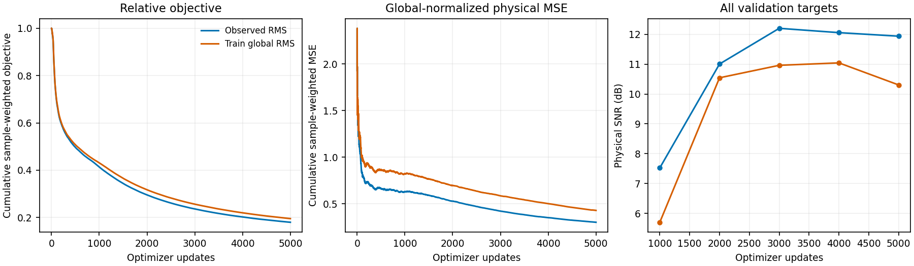
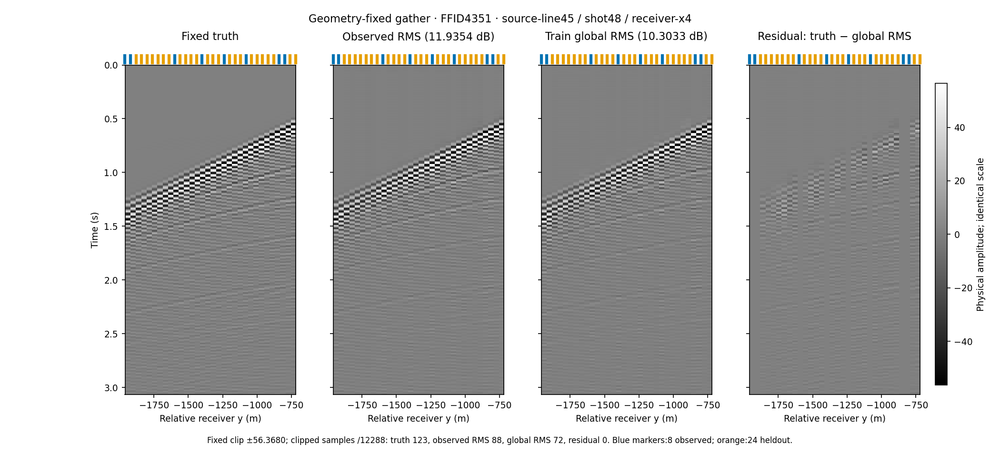
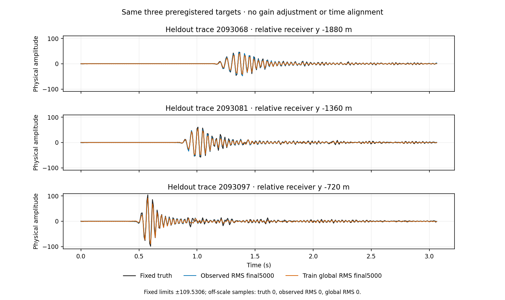

# C3 proposed GNN: global RMS と observed trace RMS の比較（2026-09-10）

固定 QC validation 全 **58,999 本 × 384 = 22,655,616 samples** に対する、`train_global_rms` の独立 final 5,000 更新の物理 SNR は **10.3033 dB、RMSE 3.0350** だった。採用済み `observed_trace_rms` の final 5,000 更新 **11.9354 dB / RMSE 2.5151** との差は **-1.6321 dB**。比較結果を調査図表として採用し、従来の observed RMS モデルの採用を維持する。 [判断と checkpoint SHA](../results/study_032_c3_proposed_gnn_10db/20260910T000707692524Z_6d0cdf28f9ef_global_rms_relative_mse_publication/adoption_decision.json)。

| 同じ全 validation target | final SNR (dB) | final RMSE | 主 checkpoint |
|---|---:|---:|---|
| observed trace RMS | 11.9354 | 2.5151 | final 5,000 |
| train global RMS | 10.3033 | 3.0350 | final 5,000 |

native 設定の科学的な差は **`model.amplitude_mode: observed_trace_rms → train_global_rms` の一項目だけ**である。QC 後の canonical train 1,146,366 本、時間0:384、global RMS **28.627922455065246**、幅64・101,701 parameters、2 rounds、各関係2近傍・共通尺度320m/320m・半径1・exact index を維持した。seed20260908、query batch128、AdamW学習率10⁻³・weight decay0・gradient clip1、fresh5,000更新、FP32・cuDNN benchmark=false も同じ。入力bindingは設定hash/Git由来の記録以外一致した。新旧constructorの初期weights/RNG同値は既存テストで確認したもので、新実runの初期weights保存を別途計測した主張ではない。

新条件はモデル内の観測trace自身のunit RMS正規化と、直接observed senderから求めるquery IDW gainを使わない。この一項目は入力単位化と出力利得を同時に切り替えるので、差をどちらか一方の独立効果とは断定しない。固定train global RMSによる入力の除算・物理出力への乗算は各一回残る。**relative MSE の教師RMSは両条件とも維持し、detachしたtrain labelのloss重みにだけ使う。** 教師尺度をforwardや予測gainへ渡していない。内部latent GroupNormも変更していないため、すべての正規化を除去した実験ではない。437本の異常除外・有効ゼロ1,195本の保持、validation target真値は採点・可視化のみ、test未使用、固定shear/learned lagなしという境界も同じである。

左は累積sample重み付きrelative objective、中央は累積global-normalized physical MSE、右は1,000更新ごとの全validation target SNR。最後のbatch値とは区別している。新条件のbestは **4,000更新**で、別保存のbest補助予測は **11.0417 dB / RMSE 2.7877**。旧条件のbest3,000更新の補助予測12.1987dBを主比較へ置き換えず、両条件とも予定final5,000を報告した。新条件の学習内validation SNRはbest4,000更新の11.0417dBからfinal5,000更新の10.3033dBへ低下した。この観測だけから過学習などの原因を確定しない。延べ640,000query・245,760,000samplesで、train poolの一巡やunique coverageを意味しない。新条件のcompleted episodeは0である。

固定監査の全体statusは **success**。全targetの保存dense予測をfloat64で再採点し、native query順の全指標を完全一致させ、dense evaluatorとの加算順の微差も固定基準で照合した。観測再挿入最大差0、全予測finite、完全target coverageを確認した。final role/5,000step/hash/前処理provenanceを検証し、trainer-finalと独立frozen、best補助とtrainer-bestのenergyはそれぞれ別欄で **rtol=10⁻⁶、atol=10⁻¹²** を適用した。[全監査結果](../results/study_032_c3_proposed_gnn_10db/20260910T000707692524Z_6d0cdf28f9ef_global_rms_relative_mse_publication/summary.json)。

CPU復元はCPU forward前に固定したnative最初・中央・最後の全batch、**1,143query / 438,912samples** を使用した。normalized差RMSE **1.4623e-07**、最大差 **1.2859e-05**、physical relativeL2 **5.1474e-07** を、各固定閾値 **10⁻⁴ / 10⁻³ / 10⁻³** と照合した。normalized差は物理予測差をcheckpointの固定global RMSで割った値で、両modeで同じ定義である。target真値をforwardに渡さず、CPU1thread/CUDA未初期化で行う部分工程監査であり、全targetのCPU bitwise再生成ではない。閾値の事後変更はしていない。

| 新条件の完了工程 | native process全体 (s) | peak allocated (GB) | peak reserved (GB) |
|---|---:|---:|---:|
| training + validation + best補助予測 | 2919.0425 | 9.1865 | 38.1241 |
| 独立final prediction | 121.0184 | 1.4479 | 8.6549 |

GPU資源は各native processの計測範囲で、optimizer更新だけの量や専有GPUでの定常速度ではない。訓練・予測はTF32の両起動override0、matmul highest/TF32 false、cuDNN benchmark falseを維持し、cuDNN TF32許可・deterministicの個別native値も集計JSONに保持した。予備計測はB128の有限な1更新と1/8/32query推論が成功した一方、全体はfull512計測不足の **blocked estimator** のまま保存した。既存512実測と資源判断で本学習を実行したので、予備計測全体PASSとは記さない。技術的な準備失敗と本学習の品質再試行は別で、品質retryはない。

source-line45・shot48・receiver-x4、FFID4351の同じ32本（observed8/heldout24）、relative receiver-y −1960〜−720mである。既存の固定truthCSVを再利用し、真値/旧予測/新予測/新残差は共通 **±56.3680**。各12,288samplesのclip数は truth 123、旧 88、新 72、新残差 0。全対象採点には表示clipを適用しない。

ID2093068・2093081・2093097、共通表示 **±109.5306**。範囲外sample数はtruth 0、旧 0、新 0。予測品質による選別、利得調整、時間合わせは行わず、新たなraw振幅読取やモデルforwardも図の生成には用いていない。これは単一seed・固定validationでのnormalization ablationであり、architecture優越や未使用testへの汎化を示すものではない。旧global RMS・物理MSE・TF32条件の監査不合格は別条件の履歴として維持する。

元sourceは既存093547の凍結182Python filesを再利用し、元run/checkpoint/全予測を変更していない。[manifest](../results/study_032_c3_proposed_gnn_10db/20260910T000707692524Z_6d0cdf28f9ef_global_rms_relative_mse_publication/manifest.json)にsource/artifactSHA、[既存検証command記録](../results/study_032_c3_proposed_gnn_10db/20260910T000707692524Z_6d0cdf28f9ef_global_rms_relative_mse_publication/verification_commands.json)に正確な範囲を保持した。公開図表は新解析runからbyte-identicalに配置した。

断面図は元図を保持したまま見出し位置だけを直した[派生表示](../results/study_032_c3_proposed_gnn_10db/20260910T002353442297Z_6d0cdf28f9ef_global_rms_comparison_layout/manifest.json)を使用した。選択・波形・表示尺度・clip数は同一である。
