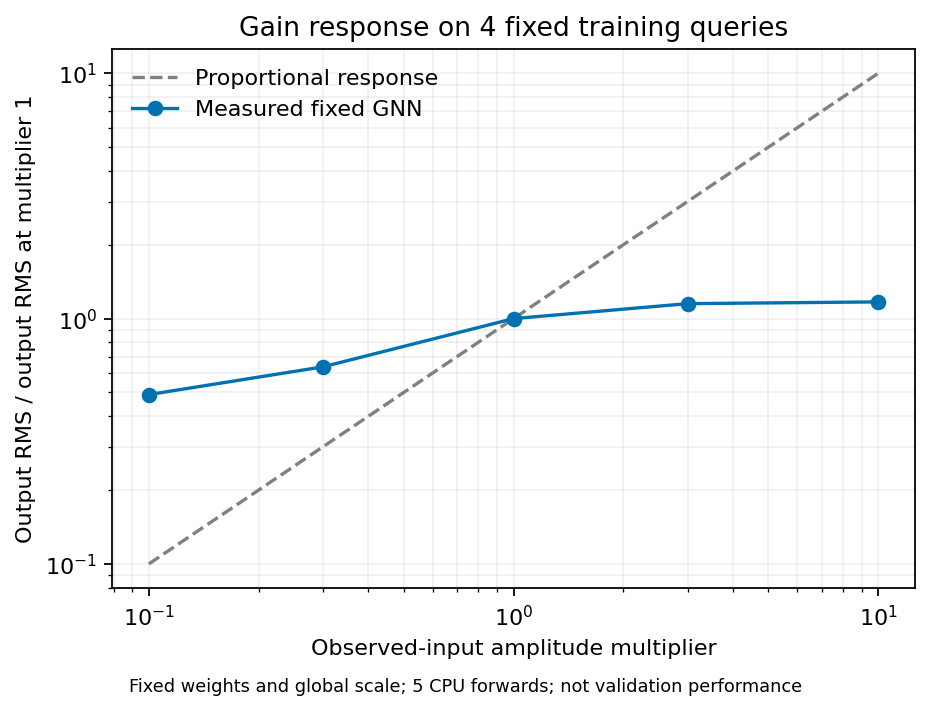

# C3 proposed GNN の基準結果と学習・計算量の診断 — 2026-09-09

**QC 後の200更新 baseline は、全欠測 target の物理 SNR 0.0144 dB、RMSE 9.9222だった。保存予測の再採点と checkpoint 復元監査は通過したが、GNN の10 dB目標は未達である。** この報告は完了済み baseline と診断の記録であり、GNN モデルの採用判断ではない。幅64・query batch128・学習率10⁻³・global RMS・5,000更新の [次の run](../runs/study_032_c3_proposed_gnn_10db/20260909T064032733552Z_e39df16d563c_gnn-train/request.json) は、今回の集計時点では進行中で、完成指標を含めていない。

入力は [Study032 の契約](../studies/study_032_c3_proposed_gnn_10db/README.md)に従い、異常437本を除外した Study029 の固定 QC suite を使う。validation は `c3_benchmark_validation_random_trace_80_seed142`、観測14,729本、欠測 **58,999本×384 = 22,655,616 samples**、時間0–3.064 sである。学習と尺度 fit は別の canonical train 1,146,366本の `[0,384)` のみを使い、固定 global RMS は28.6279。episode の hidden 波形はラベル専用とし、入力には visible 波形だけを与える。validation 推論の波形入力は同じ crop の観測だけで、target 真値は採点にのみ使い、test partition は未使用である。

| 完了済みの全 validation target 評価 | 物理 SNR (dB) | 物理 RMSE |
| --- | ---: | ---: |
| zero-fill | 0.0000 | 9.9386 |
| GNN baseline・final checkpoint の独立予測 | **0.0144** | **9.9222** |

baseline は幅32、27,333 parameters、2 rounds、関係ごと近傍2本、query batch4、学習率10⁻⁴、seed20260908で200更新した。正規化尺度と幾何を固定し、明示的な `exact_index` 検索を使用した。検証・独立予測の query batch は512である。[学習 run](../runs/study_032_c3_proposed_gnn_10db/20260909T061757682539Z_e39df16d563c_gnn-train/native/run.json) と [独立予測 run](../runs/study_032_c3_proposed_gnn_10db/20260909T062735671200Z_e39df16d563c_gnn-predict/native/run.json) の全体時間は、外側の実行記録で389.6172 sと144.8925 s、native processでは368.1193 sと138.3450 sだった。学習側の時間には validation と best checkpoint の補助予測も含む。native process 内の PyTorch 最大 allocated GPU memory はそれぞれ30.3372 GBと0.7469 GBであり、optimizer 更新だけの使用量ではない。

全対象を保存配列から CPU・float64 で再採点し、query index の元の順序で native 指標と完全一致した。独立予測の SNR は0.014369424212006265 dB、trainer の final validation は0.014369785017596115 dBで、両者の誤差エネルギーは事前固定の `rtol=10⁻⁶, atol=10⁻¹²` を満たした。dense volume の共通 evaluator と query 順の evaluator には float64 加算順による微差があり、こちらも基準内である。全予測は有限、全対象を漏れなく含み、観測値の再挿入後の最大差は厳密に0だった。best と final は別に検証し、この baseline では両者の重みも一致した。[全対象監査](../runs/study_032_c3_proposed_gnn_10db/20260909T063224611091Z_e39df16d563c_qc_baseline_audit/verification/result.json)。

CPU checkpoint 復元は別の部分監査である。事前固定の最初・中央・最後の native batch、512+512+119 = **1,143本、438,912 samples** を、保存尺度・重みと観測波形から復元した。正規化差 RMSE は5.2952×10⁻⁶、正規化差最大値は8.2391×10⁻⁵、physical relative L2 は0.0005。固定閾値はそれぞれ10⁻⁴、10⁻³、10⁻³で、すべて通過した。target 真値は forward に渡していない。これは CPU と native GPU の部分的な工程照合であり、全対象の復元や bitwise 一致を主張しない。今回の合格は、旧 Study028 の [training/frozen エネルギー不一致](../runs/study_028_c3_first_results/20260908T153234862216Z_edda0ae6aa06_gnn_final_metric_audit/result.json)を取り消さない。

一方、同じ訓練4 query を繰り返し学習する CPU 診断では、十分に当てはめられた。幅32・2 rounds・近傍2本・同じ初期重みから、各学習率で1,000更新し、その4本だけを物理振幅で採点した。

| 固定した訓練4本への fit（validation ではない） | 物理 SNR (dB) | 物理 RMSE |
| --- | ---: | ---: |
| 学習率10⁻⁴ | 16.5758 | 1.7021 |
| 学習率10⁻³ | 20.0908 | 1.1356 |

この結果はモデルが固定訓練例へ fit できる証拠であり、未観測位置への汎化や GNN の目標達成を示さない。両条件の checkpoint CPU 復元は元の予測と bitwise 一致し、validation/test 波形を読まなかった。全対象 baseline と訓練4本を混同しないよう、[物理指標 CSV](../results/study_032_c3_proposed_gnn_10db/20260909T064716512367Z_e39df16d563c_baseline_diagnostics_publication/physical_metrics_by_scope.csv) に評価範囲を明記した。

この学習率10⁻³の固定訓練モデルについて、観測入力の振幅だけを0.1・0.3・1・3・10倍にする追加診断を行った。重み・幾何・global RMS は変えず、CPU forward は5回だけで、追加学習はない。出力 RMS の倍率はそれぞれ0.4902・0.6357・1.0000・1.1507・1.1698で、比例応答から大きく外れた。入力1倍では元の fit 指標を完全に再現した。倍率を合わせた訓練教師への SNR は−13.6876・−4.9384・20.0908・3.6894・0.9526 dBだった。[gain 応答 CSV](../results/study_032_c3_proposed_gnn_10db/20260909T064716512367Z_e39df16d563c_baseline_diagnostics_publication/gain_response.csv)。

この入力範囲と固定モデルでは振幅の応答が圧縮されている。正規化を含む計算経路を調べる理由にはなるが、GroupNorm が原因だと確定する実験ではなく、validation 精度の改善証拠でもない。教師振幅への後付けの合わせ込みを primary score に使っていない。

CPU の幾何検索診断は振幅もモデルも読まず、同じ距離・近傍順・graph 配列を比較した。index の初回構築は train 0.4285 s、validation 0.0161 sで、下表の検索時間はその index を再利用した単発測定である。

| domain / query 本数 | brute 検索 (s) | exact index 検索 (s) | graph 配列・metadata の一致 |
| --- | ---: | ---: | --- |
| train / 4 | 1.2022 | 0.0487 | 完全一致 |
| train / 32 | 6.8092 | 0.3448 | 完全一致 |
| train / 128 | 25 sで timeout | 1.1892 | 未検証 |
| validation / 32 | 0.2206 | 0.0705 | 完全一致 |
| validation / 128 | 0.6590 | 0.2070 | 完全一致 |
| validation / 512 | 1.8917 | 0.6181 | 完全一致 |

さらに同じ訓練 episode 内で observed sender の近傍を cache すると、query128本の初回は非cache 1.2518 sに対し1.1997 s、同じ query の反復は1.2723 sに対し0.2438 sだった。query の半分重複・反復・並べ替えを含む全10条件で graph 配列と metadata は完全一致した。最大の記録は1,002 sender・8,016 edges・192,384 bytesの配列で、Python container の overhead は含まない。単一 episode・各配置1回の測定であり、学習全体の速度や中央値ではない。episode の観測集合が変われば、その集合に対応した index/cache を作り直す。[検索・cache 診断の全測定値](../results/study_032_c3_proposed_gnn_10db/20260909T064716512367Z_e39df16d563c_baseline_diagnostics_publication/diagnostic_summary.json)。

GPU の予備測定も品質比較から分けた。各条件は別 process の新規モデルで、train は1更新、validation は予測1回だけを実行した。target 真値は読んでいない。以下は process の PyTorch 最大 allocated 値で、GBは10⁹ bytesである。

| 幅 / 処理 | query 本数 | GPU peak (GB) |
| --- | ---: | ---: |
| 32 / train | 4 | 0.2059 |
| 32 / train | 32 | 1.0815 |
| 32 / train | 128 | 4.1606 |
| 32 / validation | 32 | 0.1038 |
| 32 / validation | 128 | 0.2132 |
| 32 / validation | 512 | 0.5261 |
| 64 / train | 32 | 32.0620 |
| 64 / train | 128 | 8.2589 |

幅32は public preflight の数値設定、幅64は native 学習と同じ `high`・TF32有効・cuDNN benchmark有効の設定で測った。幅64では小さい batch の方が peak が大きく、batch 本数から使用量の単調性は推定できない。共有 GPU の最初の1回であり、定常 throughput や全学習時間の予測値でもない。baseline の実学習 process の peak とも区別する。

[SIREN の11.3422 dB](../results/study_031_c3_siren_10db/20260909T055026000000Z_e39df16d563c_shear_reference_adoption/adoption_decision.json)は、固定 shear 0.0006 s/mを明記した採用参照として保持する。GNN には shear を導入していない。また SIREN は validation の観測から学習し、GNN は別の canonical train を使うため、同じ学習情報量・同じ前処理の比較とは主張しない。

[診断 manifest](../results/study_032_c3_proposed_gnn_10db/20260909T064716512367Z_e39df16d563c_baseline_diagnostics_publication/manifest.json) は、元の run・監査・checkpoint・予測配列の参照と SHA256 を保持する。compact JSON・CSV・PNG は新しい解析 run から byte-identical に採用し、元の run や大きな配列を変更していない。本文は小数4桁を基本とし、機械可読値は丸めず保存した。この集計は2026-09-09 06:49 UTC時点の完了記録に限る。
