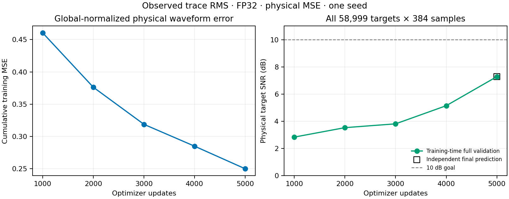

# C3 proposed GNN の observed RMS・FP32・5,000更新 — 2026-09-09

**observed-trace RMS を使う GNN の独立 final 予測は、全欠測 target の物理 SNR 7.2797 dB、RMSE 4.2987だった。保存予測の全対象再採点、訓練時とのエネルギー照合、事前固定した CPU 復元監査はすべて合格した。** 10 dB目標は未達であり、採用するのは調査図表である。モデルは採用しない。

固定 QC suite の validation case `c3_benchmark_validation_random_trace_80_seed142` を使い、観測14,729本から、欠測 **58,999本×384 = 22,655,616 samples** を評価した。学習ラベルは別の canonical train 1,146,366本の `[0,384)` に限る。人工 mask の visible 波形を入力し、hidden 波形をラベルとした。validation では観測波形だけを予測入力と尺度計算に使い、target 真値は採点にのみ用いた。test partition は未使用、固定 shear は0である。

`observed_trace_rms` は各 observed 波形を自身の RMS で正規化し、query の尺度は直接 observed sender を重複除去した IDW で求める。物理単位へ戻した予測と教師の誤差を、訓練集合の固定 global RMS 28.6279で正規化した `masked_mse` で学習した。本実験の loss は trace-relative MSE ではない。

| 同じ全 validation target の独立 final 予測 | SNR (dB) | RMSE | 全保存予測再採点 | cross-run／CPU 復元 |
| --- | ---: | ---: | --- | --- |
| 旧 global RMS・TF32・5,000更新 | 7.4002 | 4.2395 | 合格 | 不合格を保持 |
| 今回 observed RMS・FP32・5,000更新 | **7.2797** | **4.2987** | 合格 | 合格 |

今回の SNR は旧条件より0.1205 dB低い。[旧 global RMS の調査](c3_proposed_gnn_global_rms_5k_20260909.md)からは、振幅処理と数値方針の両方が変わっているため、observed RMS 単独の効果とは解釈しない。今回の合格によって旧 run の不合格を取り消さない。[丸めない比較 CSV](../results/study_032_c3_proposed_gnn_10db/20260909T092730969384Z_e39df16d563c_observed_rms_fp32_5k_publication/physical_comparison.csv)。

モデルは幅64・101,701 parameters、2 rounds、各関係の近傍2本、query batch128、学習率10⁻³、seed20260908で fresh training した。`exact_index` と observed cache を使い、共通距離尺度320 m・320 m、半径1で固定した。5,000更新で **640,000 query・245,760,000 samples** を提示し、完了した mask episode は0、最後の episode は途中終了だった。訓練 pool 一巡を意味しない。best と final はともに5,000更新で、重みの一致と各 role を監査した。[元の訓練指標](../runs/study_032_c3_proposed_gnn_10db/20260909T080650653168Z_e39df16d563c_gnn-train/native/metrics.json)。

左図は各時点までの正規化誤差エネルギーを累積 sample 数で割った MSE、右図は1,000更新ごとの全 target SNRである。右図は2.8327 → 3.5276 → 3.8076 → 5.1418 → 7.2797 dBとなった。5,000更新の累積 MSE は0.2500、最後の batch MSE は0.0420で、異なる集計値である。独立 final 予測は右端の訓練時評価と図上で重なる。[曲線 CSV](../results/study_032_c3_proposed_gnn_10db/20260909T092730969384Z_e39df16d563c_observed_rms_fp32_5k_publication/learning_progress.csv)。

| 固定監査 | 結果・事前基準 |
| --- | --- |
| 全 target の CPU・float64 再採点 | native query 順で指標完全一致、dense evaluator との照合も合格 |
| 全予測の有限性・target 網羅性・観測再挿入 | 合格、観測最大差0 |
| trainer final と独立 frozen の誤差エネルギー | 相対差1.4420×10⁻¹⁰、`rtol=10⁻⁶`・`atol=10⁻¹²`で合格 |
| final role・step・hash・前処理 provenance、別の best 補助予測 | 合格 |
| CPU 復元の正規化差 RMSE | 1.7837×10⁻⁷ ≤ 10⁻⁴ |
| CPU 復元の正規化差最大値 | 9.7939×10⁻⁶ ≤ 10⁻³ |
| CPU 復元の physical relative L2 | 6.6866×10⁻⁷ ≤ 10⁻³ |

[監査正本](../runs/study_032_c3_proposed_gnn_10db/20260909T081425547636Z_e39df16d563c_observed_rms_fp32_completion_handoff/verification/result.json)の CPU 復元は、事前固定した最初・中央・最後の native batch、512+512+119 = **1,143 query・438,912 samples** の部分監査である。CPU 1 threadで保存 checkpoint と前処理を復元し、target 真値を forward へ渡していない。正規化差は物理予測差を checkpoint の global amplitude scale で割った値で、閾値は変更していない。全対象の checkpoint 再生成や bitwise 一致の主張ではない。全対象の保存予測の真値 energy は2.2378×10⁹、誤差 energy は4.1866×10⁸である。dense 順と native query 順の float64 加算順による微差は、別欄で基準内と確認した。

訓練・独立予測・CPU 監査は、起動時に `TORCH_ALLOW_TF32_CUBLAS_OVERRIDE=0` と `NVIDIA_TF32_OVERRIDE=0` を固定した。native 記録では GPU の両工程とも float32 matmul は `highest`、CUDA matmul TF32 は無効、cuDNN TF32 許可フラグは有効、deterministic は無効だった。**cuDNN benchmark は訓練で有効、独立予測で無効**だった。CPU 監査は `highest`・1 thread・CUDA 未初期化で、cuDNN benchmark 値は記録しておらず推定しない。[訓練記録](../runs/study_032_c3_proposed_gnn_10db/20260909T080650653168Z_e39df16d563c_gnn-train/native/run.json)・[独立予測記録](../runs/study_032_c3_proposed_gnn_10db/20260909T091943454780Z_e39df16d563c_gnn-predict/native/run.json)。

| 完了した工程 | native process 全体 (s) | 外側の実行時間 (s) | GPU peak allocated (GB) |
| --- | ---: | ---: | ---: |
| 5,000更新の訓練 | 4341.5328 | 4366.1024 | 47.9984 |
| final checkpoint の独立予測 | 103.4689 | 109.9363 | 1.4480 |

GB は10⁹ bytes、GPU は H100 NVLである。訓練 process の peak には定期 validation と best の補助予測が含まれる。共有 GPU 上の1回の完走値であり、optimizer 更新だけの資源量や単発予備測定とは区別する。

次候補の trace-relative MSE は、[訓練 energy の集中](c3_proposed_gnn_training_energy_20260909.md)を根拠に選ぶ。全 train の冒頭64 samples が真値 energy の92.6812%を占め、RMS 上位1%の trace が79.2234%を占めた。教師 RMS を loss の重みにだけ使う候補であり、観測入力や query の予測尺度へ教師 RMS を渡すものではない。[固定4本・1,000更新の訓練専用診断](../runs/study_032_c3_proposed_gnn_10db/20260909T091758495983Z_e39df16d563c_relative_mse_fixed_training_fit/result.json)では、同条件の物理 MSE の21.1003 dBに対し、relative MSE は21.3990 dBだった。これは4本への fit の証拠に限り、全 validation の改善や10 dB達成を示さない。次候補の本学習結果は本報告に含めない。

[集計 JSON](../results/study_032_c3_proposed_gnn_10db/20260909T092730969384Z_e39df16d563c_observed_rms_fp32_5k_publication/observed_rms_fp32_summary.json)と[manifest](../results/study_032_c3_proposed_gnn_10db/20260909T092730969384Z_e39df16d563c_observed_rms_fp32_5k_publication/manifest.json)は、入力 suite、元指標、監査、checkpoint、予測配列の SHA256 を保持する。図表は新規解析 run から byte-identical に採用した。大きな予測・重みは元 run に残し、既存結果を変更していない。解釈は1 seed・固定 validation の完了記録に限る。
