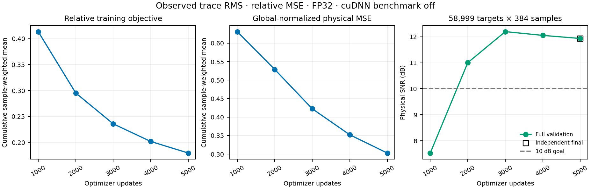
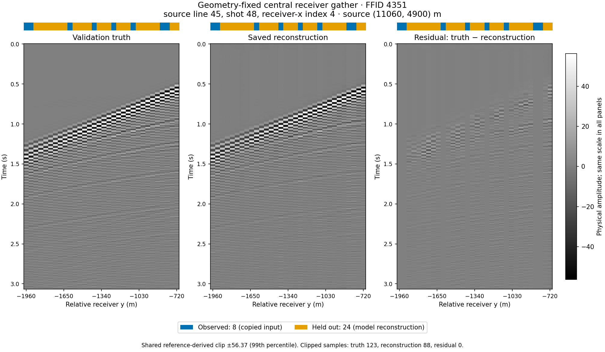
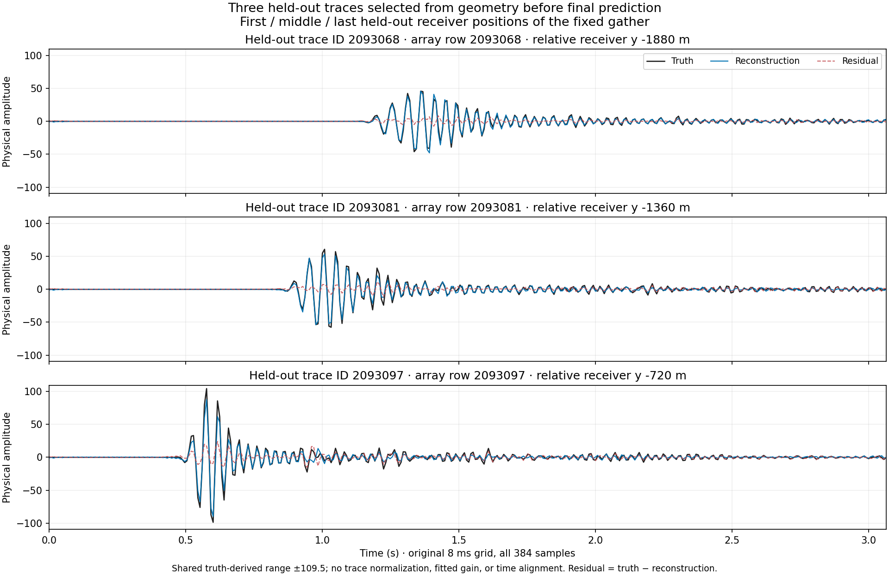

# C3 proposed GNN の relative MSE・FP32・5,000更新 — 2026-09-09

**固定 shear を使わない proposed GNN の独立 final 予測は、全欠測 target の物理 SNR 11.9354 dB、RMSE 2.5151だった。全対象の保存予測再採点、訓練時とのエネルギー照合、事前固定した CPU 復元監査がすべて合格し、予定した final 5,000更新のモデルを採用する。** 本判断は1 seed・固定 validation case の10 dB目標に対するもので、未使用 test や別データへの汎化を確認したものではない。[採用判断と checkpoint の SHA256](../results/study_032_c3_proposed_gnn_10db/20260909T105511479095Z_00e9e555d9fb_relative_mse_final_publication/adoption_decision.json)。

入力は QC 後の固定 suite、case `c3_benchmark_validation_random_trace_80_seed142`。validation の観測14,729本を入力とし、欠測 **58,999本×384 = 22,655,616 samples** を物理振幅で評価した。訓練ラベルは別の canonical train 1,146,366本の `[0,384)` に限る。既存 QC による異常437本の除外を維持し、有効なゼロ波形1,195本は保持した。validation target 真値は採点・可視化にのみ用い、test partition は未使用である。固定 shear と learned edge lag はどちらも使っていない。

`observed_trace_rms` は observed 波形を自身の RMS で正規化し、query の尺度を直接 observed sender の重複除去後、共通距離尺度の IDW から推定する。今回の `masked_trace_relative_mse` は、**教師 trace の RMS を loss の重みにだけ使う**。教師 RMS は勾配から切り離し、forward 入力・query の予測尺度には渡さない。ゼロ RMS の除数は1で、正の下限値は加えていない。固定 global RMS 28.6279による前処理・物理単位の対応も保持した。[訓練 energy の集中](c3_proposed_gnn_training_energy_20260909.md)を受け、少数の大振幅 trace が物理 MSE を支配する配分を変える候補として選んだ。

| 同じ全 validation target の完了した予測 | SNR (dB) | target RMSE | 位置付け |
| --- | ---: | ---: | --- |
| GNN observed RMS・物理 MSE・FP32、final 5,000 | 7.2797 | 4.2987 | 全固定監査に合格した基準 |
| GNN observed RMS・relative MSE・FP32、final 5,000 | **11.9354** | **2.5151** | 今回の採用モデル、固定 shear なし |
| SIREN、final 5,000 | 11.3422 | 2.6929 | 固定 shear 付きの参照採用 |

[丸めない比較 CSV](../results/study_032_c3_proposed_gnn_10db/20260909T105511479095Z_00e9e555d9fb_relative_mse_final_publication/physical_comparison.csv)。GNN 基準との訓練・validation 入力 binding は一致し、native config の変更は **loss と訓練 cuDNN benchmark の有効→無効の2点**だった。そのため、4.6557 dBの改善を loss 単独の効果とは断定しない。[基準の報告](c3_proposed_gnn_observed_rms_fp32_5k_20260909.md)に残る旧 global RMS・TF32 条件の監査不合格も取り消さない。

SIREN は同じ validation crop の観測14,729本を毎更新すべて使い、固定 shear 0.0006 s/mを加えて学習した参照条件である。GNN は別の train partition からラベルを使う。5,000更新での提示回数は、GNN が640,000 query・245,760,000 samples、SIREN が73,645,000 trace・28,279,680,000 samplesで、学習情報も計算量も揃っていない。SIREN へ適用した変換を GNN へ移しておらず、この表だけで architecture の優劣を分離できない。[SIREN の参照採用条件](../results/study_031_c3_siren_10db/20260909T055026000000Z_e39df16d563c_shear_reference_adoption/adoption_decision.json)。

GNN は幅64・101,701 parameters、2 rounds、各関係の近傍2本、共通距離尺度320 m・320 m、半径1、`exact_index` と observed cache を使った。query batch128、AdamW・学習率10⁻³・weight decay0、seed20260908で fresh 5,000更新を完了した。完了した mask episode は0で、最後の episode は途中終了だった。640,000 query の提示は train pool 一巡を意味しない。

左・中央はそれぞれ累積 sample 数で重み付けした relative objective と global-normalized physical MSEで、異なる量を別軸に示した。右の全 target SNR は1,000更新ごとに **7.5269 → 11.0035 → 12.1987 → 12.0540 → 11.9354 dB**となった。best は3,000更新で、別保存の補助予測は12.1987 dB・RMSE 2.4400だった。best と final の重みは異なり、採用は事前の判断規則どおり final 5,000更新を使う。最後の batch の relative objective は0.0810、累積値は0.1796である。[曲線 CSV](../results/study_032_c3_proposed_gnn_10db/20260909T105511479095Z_00e9e555d9fb_relative_mse_final_publication/learning_progress.csv)。

| 固定監査 | 結果・事前基準 |
| --- | --- |
| 全 target の CPU・float64 保存予測再採点 | native query 順で指標完全一致、dense evaluator との照合も合格 |
| 全予測の有限性・target 網羅性・観測再挿入 | 合格、観測最大差0 |
| trainer final と独立 frozen の誤差エネルギー | 相対差1.4331×10⁻¹⁰、`rtol=10⁻⁶`・`atol=10⁻¹²`で合格 |
| final role・step・hash・前処理 provenance、別の best 補助予測 | 合格 |
| CPU 復元の正規化差 RMSE | 1.0269×10⁻⁷ ≤ 10⁻⁴ |
| CPU 復元の正規化差最大値 | 6.1962×10⁻⁶ ≤ 10⁻³ |
| CPU 復元の physical relative L2 | 3.3955×10⁻⁷ ≤ 10⁻³ |

[監査正本](../runs/study_032_c3_proposed_gnn_10db/20260909T094810579105Z_e39df16d563c_relative_mse_no_benchmark_completion_handoff/verification/result.json)の CPU 復元は、事前固定した最初・中央・最後の native batch、512+512+119 = **1,143 query・438,912 samples** の部分監査である。保存 checkpoint と前処理をそのまま使い、target 真値を forward へ渡していない。正規化差は物理予測差を checkpoint の global amplitude scale で割った値である。閾値は結果を見て変更しておらず、全対象の checkpoint 再生成や bitwise 一致の保証ではない。全保存予測の真値 energy は2.2378×10⁹、誤差 energy は1.4331×10⁸だった。dense 順と native 順の float64 加算順による微差は別に照合した。

訓練・独立予測・CPU 監査の起動時には `TORCH_ALLOW_TF32_CUBLAS_OVERRIDE=0` と `NVIDIA_TF32_OVERRIDE=0` を固定した。GPU native 記録では両工程とも float32 matmul は `highest`、CUDA matmul TF32 は無効、cuDNN TF32 許可フラグは有効、**cuDNN benchmark は無効**、deterministic は無効だった。CPU 監査は `highest`・1 thread・CUDA 未初期化で、cuDNN benchmark 値は記録しておらず推定しない。単に FP32 と呼ぶだけでなく、これらの実行条件を[集計 JSON](../results/study_032_c3_proposed_gnn_10db/20260909T105511479095Z_00e9e555d9fb_relative_mse_final_publication/relative_mse_summary.json)に分けて保持した。

| 完了した工程 | native process 全体 (s) | 外側の実行時間 (s) | GPU peak allocated (GB) | GPU peak reserved (GB) |
| --- | ---: | ---: | ---: | ---: |
| 5,000更新の訓練 | 3444.5858 | 3468.1326 | 9.1872 | 41.7753 |
| final checkpoint の独立予測 | 98.2014 | 105.1537 | 1.4480 | 8.6549 |

GB は10⁹ bytes、GPU は H100 NVL。訓練 process の時間・peak は定期 validation と best 補助予測を含む。共有 GPU 上の1回の完走値で、optimizer 更新だけの資源量や定常 throughput を測ったものではない。独立予測・監査はそれぞれ1回で、品質を理由とした再試行はない。

図は予測の完成前に幾何だけから固定した中央 source-line／shot／receiver-x の32本（観測8本・target24本）である。source は(11060, 4900) m、relative receiver-y は−1960〜−720 m。真値・再構成・残差は共通の **±56.3680**（選択断面の真値絶対値99th percentile）で表示した。12,288 samples中の clip 数は真値123・再構成88・残差0。残差は真値−保存予測で、観測列の再構成は入力の再挿入である。

代表 trace ID2093068・2093081・2093097も幾何による事前選択で、波形の利得調整や時間合わせは行っていない。共通表示範囲内に全 sample があり、残差が残る様子も示している。これらは定性確認であり、全対象指標を置き換える好例の選別ではない。[図の選択・尺度・元データ記録](../results/study_032_c3_proposed_gnn_10db/20260909T105511479095Z_00e9e555d9fb_relative_mse_final_publication/figure_metadata.json)。

[manifest](../results/study_032_c3_proposed_gnn_10db/20260909T105511479095Z_00e9e555d9fb_relative_mse_final_publication/manifest.json)は元 run、入力、final／best checkpoint、全予測、監査、図表の SHA256 を保持し、[実装検証記録](../results/study_032_c3_proposed_gnn_10db/20260909T105511479095Z_00e9e555d9fb_relative_mse_final_publication/verification_commands.json)も参照できる。採用ファイルは新規解析 run から byte-identical にコピーした。断面図は保存済み選択波形からレイアウトだけを修正した派生図で、原図・選択・値・尺度は保持した。モデル重みと全予測配列は元 run に残し、訓練時 source と公開時 Git HEAD を区別して記録した。
