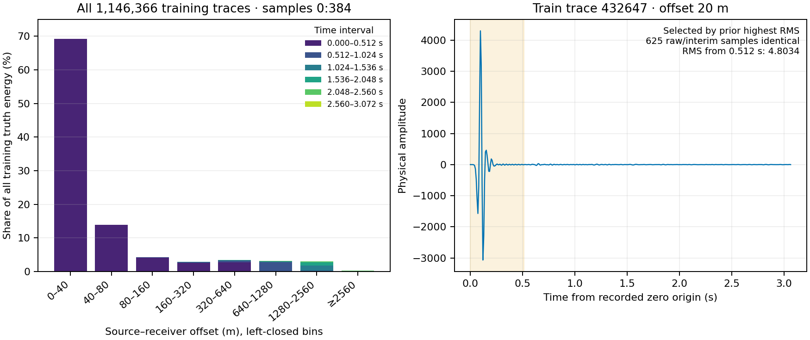

# C3 proposed GNN の訓練エネルギー分布と元 SEG-Y 照合 — 2026-09-09

**QC 後の訓練データでは、offset 40 m未満の4,760本に全真値エネルギーの69.1804%、冒頭64 samplesに92.6812%が集中していた。RMS 上位8本は、元 SEG-Y と interim の625 samplesすべてが bitwise 一致した。** 近 offset・冒頭の高振幅は元データにも存在するという観測であり、直接波などの物理的な同定や、データ破損の断定ではない。追加除外、正規化尺度、学習条件は変更していない。

対象は異常437本の除外後の canonical train **1,146,366本×384 = 440,204,544 samples** である。時間は既存の0秒起点・8 ms間隔を使い、学習範囲は `[0,384)` のままにした。先行する[訓練エネルギー探索](../runs/study_032_c3_proposed_gnn_10db/20260909T081013427411Z_e39df16d563c_training_energy_distribution/result.json)の RMS 順位から選ばれた8本を元データ照合に用いた。これは探索結果に基づく高 RMS の選択であり、無作為抽出や訓練全体の典型例ではない。全訓練データの集計に使う offset 境界と64 samplesごとの6時間帯は、今回の実行前に固定した。[監査 request](../runs/study_032_c3_proposed_gnn_10db/20260909T081542007059Z_e39df16d563c_training_energy_source_qc/request.json)。

選択した ID は432647、486983、232406、617239、325700、326264、644439、424572。検証済み訓練 domain の `trace_id → array_row` を通じて `traces.parquet` の `source_file / trace_index` に対応させ、既存 SEG-Y reader で該当8 traceだけを読んだ。例えば ID617239 は `SEG_C3NA_ffid_1201-2400.sgy` のゼロ始まり trace index42311に対応する。元ファイル2本の SHA256 は interim の dataset 記録と一致した。

8本とも offset20.0000 mで、元 SEG-Y／interim の **8×625 = 5,000 samples** が bitwise 一致し、最大差は0だった。学習窓内の絶対ピークは4298.4102–4298.7070、時刻はすべて0.0960 sだった。全窓の RMS は371.1161–371.2891だが、冒頭64 samplesを除いた `[64,384)` の RMS は2.7122–6.7566だった。625 samplesの照合は元データ確認だけで、学習窓を延長していない。[8本の対応・一致・振幅統計 CSV](../results/study_032_c3_proposed_gnn_10db/20260909T082028203048Z_e39df16d563c_training_energy_publication/selected_source_checks.csv)。

左図の分母は全訓練384 samplesの真値エネルギーで、色は時間帯を表す。右図は事前選択8本の先頭 ID432647の物理波形で、振幅の再正規化はしていない。色付き領域は `[0,64)`、すなわち `[0,0.512)` sである。[波形 CSV](../results/study_032_c3_proposed_gnn_10db/20260909T082028203048Z_e39df16d563c_training_energy_publication/representative_waveform.csv)・[offset×時間の全集計 CSV](../results/study_032_c3_proposed_gnn_10db/20260909T082028203048Z_e39df16d563c_training_energy_publication/offset_time_energy.csv)。

| offset 帯（m、左閉右開） | 訓練 trace 数 | 全訓練の真値エネルギー比 |
| --- | ---: | ---: |
| 0–40 | 4,760 | 69.1804% |
| 40–80 | 14,279 | 13.8692% |
| 80–160 | 47,600 | 4.2609% |
| 160–320 | 85,679 | 2.8888% |
| 320–640 | 152,016 | 3.4285% |
| 640–1280 | 287,805 | 3.1386% |
| 1280–2560 | 498,995 | 2.9982% |
| 2560以上 | 55,232 | 0.2354% |

offset80 m未満の合計は83.0496%だった。[offset 集計 CSV](../results/study_032_c3_proposed_gnn_10db/20260909T082028203048Z_e39df16d563c_training_energy_publication/offset_energy.csv)。source／receiver 座標から offset を再計算し、訓練 domain と interim table の幾何対応も確認した。

RMS 上位1%は端数を切り上げた11,464本で、全エネルギーの79.2234%を占める。下表は各列の集合自身のエネルギーを分母とする。したがって「上位1%」列は全訓練に対する比率ではない。

| samples／時間帯 (s、左閉右開) | 全訓練内の時間比 | 上位1%内の時間比 | 残り1,134,902本内の時間比 |
| --- | ---: | ---: | ---: |
| 0–64／0.000–0.512 | 92.6812% | 99.9718% | 64.8814% |
| 64–128／0.512–1.024 | 3.6546% | 0.0162% | 17.5280% |
| 128–192／1.024–1.536 | 1.9181% | 0.0050% | 9.2128% |
| 192–256／1.536–2.048 | 1.3703% | 0.0040% | 6.5800% |
| 256–320／2.048–2.560 | 0.2847% | 0.0017% | 1.3636% |
| 320–384／2.560–3.072 | 0.0911% | 0.0012% | 0.4342% |

最後の実 sample は3.064 sで、3.072 sは区間の開いた右端である。[時間集計 CSV](../results/study_032_c3_proposed_gnn_10db/20260909T082028203048Z_e39df16d563c_training_energy_publication/time_energy_by_rms_group.csv)には、各集合内の比率と全訓練に対する比率の両方を保持した。

再集計した全訓練 energy は360773131061.13715で先行結果と完全一致し、各 trace の RMS 配列も完全一致した。global RMS は28.62792245506524、既存 fit の28.627922455065246と固定数値基準内で一致する。ゼロ波形1,195本を保持し、全訓練の最大絶対振幅は4298.7656だった。source 照合と全訓練集計は CPU 1 thread・14.0744 sで完了した。GPU・モデル・validation/test 波形の数値読み出しはなく、source container 全体の byte checksumと訓練 trace の数値読み出しを区別して記録した。[監査結果](../runs/study_032_c3_proposed_gnn_10db/20260909T081542007059Z_e39df16d563c_training_energy_source_qc/result.json)。

訓練のこの分布は固定 validation の評価分布と異なる。validation crop の幾何 metadataだけを読むと、全73,728 trace の offset 範囲は720.2777–1964.9936 mだった。既存の[全 target 残差診断](../runs/study_032_c3_proposed_gnn_10db/20260909T080905003548Z_e39df16d563c_global5k_residual_structure_audit/result.json)では、冒頭0–64の validation 真値 energy は全体の0.0066%にとどまり、samples64–192に global5k 予測の誤差エネルギーの85.9136%があった。今回、この比較のために validation 波形を再読していない。

真値エネルギーの集中は、ゼロ出力での MSEや同じ割合の誤差を仮定した場合の重みを示す。学習済みモデルの残差、gradient の寄与、汎化不足の原因を測ったものではない。近 offset の冒頭を強く重み付けする訓練分布と、validation の分布の違いを検討する根拠にはなるが、除外や教師の重み変更を自動的に正当化しない。また既存診断で target 真値から単一 gain を合わせても7.4002→7.5932 dB、改善は0.1930 dBだった。その教師参照値は診断だけで、採用予測へ反映していない。

[集計 JSON](../results/study_032_c3_proposed_gnn_10db/20260909T082028203048Z_e39df16d563c_training_energy_publication/training_energy_summary.json)と[manifest](../results/study_032_c3_proposed_gnn_10db/20260909T082028203048Z_e39df16d563c_training_energy_publication/manifest.json)は、元探索・source QC・入力・図表の SHA256 を保持する。採用対象は小さい調査図表だけで、元 SEG-Y、interim、大きな配列、既存結果は変更していない。本文は小数4桁を基本とし、機械可読値は丸めず保存した。GNN モデルの採用や全対象10 dB達成の判断は行っていない。
