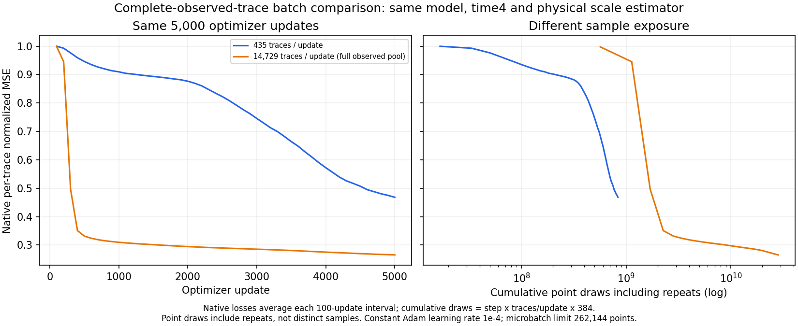
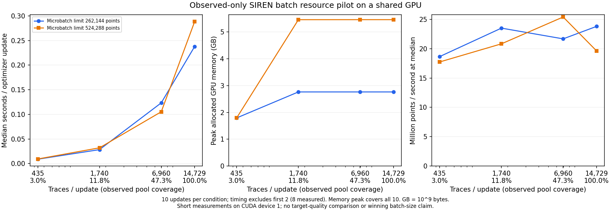

# C3 SIREN の batch 調査 — 2026-09-09

同じ 5,000 更新で、1 更新あたりの観測トレース数を 435 本から全 14,729 本へ増やすと、観測波形への適合は改善したが、欠測対象の RMSE と SNR は悪化した。本報告では、この比較と短時間の資源計測を**診断成果として採用する**。ここで比較したモデルは物理 target SNR が 10 dB を超える目標を達成しておらず、達成モデルとしての採用ではない。

固定した QC 後の validation case `c3_benchmark_validation_random_trace_80_seed142` を使用した。観測は 14,729 本、欠測対象は 58,999 本 × 384 samples = 22,655,616 samples。両条件は Cartesian 5 座標、time scale 4、幅 256・隠れ層 4、SIREN の ω は初層 90・隠れ層 30、Adam の一定学習率 10⁻⁴、microbatch 262,144 points、5,000 更新で共通し、設定差は `traces_per_step` のみである。各トレースの RMS 尺度は観測だけから計算・補間した。欠測の正解波形は採点にのみ使い、尺度の推定には使っていない。

| トレース数 / 更新 | 累積 point 数（重複を含む） | 観測 RMSE（再挿入前） | target RMSE | target SNR (dB) | 学習時間 (s) |
| ---: | ---: | ---: | ---: | ---: | ---: |
| 435 | 835,200,000 | 6.7069 | 12.0943 | −1.7051 | 32.8127 |
| 14,729（全本） | 28,279,680,000 | 5.0412 | 13.9549 | −2.9480 | 1,349.4009 |

target 指標は保存済みの全予測を float64 で独立再計算し、元の指標と一致した。観測 RMSE は、観測値を出力へ再挿入する前のモデル出力について元 run が記録した値である。全予測は有限で、再挿入後の観測最大差は両条件とも厳密に 0。入力の行 ID と保存済み尺度ベクトルも同一で、尺度範囲は 5.5129–14.4983 だった。[全精度の指標 CSV](../results/study_031_c3_siren_10db/20260909T014316871515Z_1819109f28e1_complete_batch_comparison_audit/physical_metrics.csv)、[比較・監査 JSON](../results/study_031_c3_siren_10db/20260909T014316871515Z_1819109f28e1_complete_batch_comparison_audit/batch_comparison.json)。

損失は per-trace 正規化後の MSE の 100 更新区間平均である。左は更新数、右は重複を含む累積 point 数を横軸にした。同じ 5,000 更新でも全本条件の point 数は 33.8598 倍あり、**同じ point 予算の比較ではない**。[図の数値 CSV](../results/study_031_c3_siren_10db/20260909T014316871515Z_1819109f28e1_complete_batch_comparison_audit/training_history.csv)。

「RMSE が改善したのに SNR が悪化した」という見え方は、評価した領域が異なるためである。同じ target に対しては

\[
\mathrm{SNR}=20\log_{10}\!\left(\frac{\mathrm{RMS}_{\mathrm{truth}}}{\mathrm{RMSE}_{\mathrm{target}}}\right)
\]

であり、正解の RMS が同じなら RMSE の改善は SNR の改善に対応する。今回改善したのは**観測領域**の RMSE で、**欠測対象**では RMSE も悪化している。

target で何が変わったかを、予測の強さと波形の一致に分けて確認した。正解エネルギーは両条件とも 2.2378 × 10⁹、正解 RMS は 9.9386 である。下表の cosine は平均を引かない内積に基づく値で、Pearson 相関ではない。

| トレース数 / 更新 | 予測 RMS | 予測エネルギー / 10⁹ | 正解・予測の内積 / 10⁹ | uncentered cosine |
| ---: | ---: | ---: | ---: | ---: |
| 435 | 6.1888 | 0.8677 | −0.1042 | −0.0748 |
| 14,729 | 9.4678 | 2.0308 | −0.0716 | −0.0336 |

誤差エネルギーは `Eerror = Etruth + Eprediction − 2 × dot(truth, prediction)` である。全本条件では予測エネルギーが 1.1631 × 10⁹ 増えた一方、内積の 2 倍の改善は 0.0651 × 10⁹ にとどまり、誤差エネルギーは 1.0980 × 10⁹ 増えた。この恒等式と直接計算との差は approximately 0 だった。[全精度のエネルギー CSV](../results/study_031_c3_siren_10db/20260909T014316871515Z_1819109f28e1_complete_batch_comparison_audit/target_energy_components.csv)。

全本条件の予測 RMS は正解に近いが、波形の一致を示す cosine は小さな負値である。予測と正解の RMS が等しく内積が 0 なら、誤差エネルギーは正解の約 2 倍、SNR は −3.0103 dB になる。実測 −2.9480 dB はこれに近い。保存された尺度や行順の違いでは説明できず、振幅の大きさが近づいても波形が合わなければ精度は改善しないことを示す。

資源計測では、435・1,740・6,960・14,729 本と、microbatch 262,144・524,288 points の 8 条件を比較した。1 更新内の観測プール被覆率は、それぞれ 2.9534%、11.8134%、47.2537%、100.0000%。microbatch は、1 回の勾配更新に使うトレース群をメモリに収めるための point 分割である。

共有 GPU 上の各 10 更新という短い計測で、時間集計は最初の 2 更新を除いた 8 更新、メモリ最大値は全 10 更新を対象とした。全本でも microbatch 262,144 なら peak allocated memory は 2.7630 GB、更新時間中央値は 0.2378 s だった。524,288 に増やすと 5.4558 GB・0.2883 s となり、この計測では遅くなった。GB は 10⁹ bytes で、GPU 全体の使用量ではなく対象プロセスの割り当て最大値である。この短時間の結果だけで持続速度や target 精度の優劣は決められない。[8 条件の CSV](../results/study_031_c3_siren_10db/20260909T012259271444Z_1819109f28e1_batch_resource_tables/batch_resources.csv)、[計測条件・数値 JSON](../results/study_031_c3_siren_10db/20260909T012259271444Z_1819109f28e1_batch_resource_tables/batch_resources.json)。

観測への適合改善と欠測誤差の悪化は過学習と整合する。ただし、この 2 条件では累積学習量も異なるため、原因が batch そのものか、学習期間か、座標やモデルの性質かは断定できない。「epoch が長すぎた」と結論する証拠にもならない。後続の固定 shear 実験は本報告の評価対象に含めない。

採用図表は元の解析出力を変更せずコピーした。機械可読値は丸めず保持し、本文の小数は 4 桁で表示した。元 run・入力・解析 script・採用ファイルの SHA-256 は、[batch 比較の manifest](../results/study_031_c3_siren_10db/20260909T014316871515Z_1819109f28e1_complete_batch_comparison_audit/manifest.json) と [資源計測の manifest](../results/study_031_c3_siren_10db/20260909T012259271444Z_1819109f28e1_batch_resource_tables/manifest.json) に記録している。元 JSON 内の `publication_policy` は解析時点の保留状態を保存しており、今回の診断採用はこれらの manifest に記録した。
