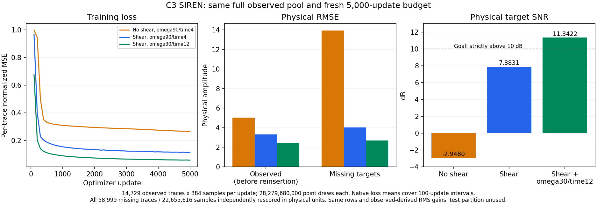

# C3 SIREN の座標診断と主比較条件 — 2026-09-09

**共通条件の主比較値は、shear 0・omega 30・time scale 12 の target SNR −3.1486 dB、RMSE 14.2809 であり、10 dB 目標は未達である。** 固定 shear 付き SIREN の 11.3422 dB、RMSE 2.6929 は測定値として維持するが、SIREN だけに補助変換を与えた結果なので、主比較から除外して補助変換付きの診断結果へ再分類する。以前の「10 dB 達成モデルとして採用」という判断は共通条件では撤回済みであり、現在の主比較の達成判断には使わない。

観測だけから shear を決めることは target 情報の漏洩を避ける条件であり、手法間の比較条件が公平であることとは別である。他手法へ shear を自動導入して条件を揃える対応は行わず、共通条件の主比較ではこの補助変換を使わない。[研究判断の記録](../studies/study_031_c3_siren_10db/decisions.md)。

QC 後の固定 case `c3_benchmark_validation_random_trace_80_seed142` の観測 14,729 本だけで学習し、欠測 58,999 本 × 384 samples = **22,655,616 samples** を採点した。下表の 4 条件とも同じ seed で新規初期化し、チェックポイントから継続せず 5,000 更新を完了した。各更新で全観測トレースを使い、累積 point 数は全条件 28,279,680,000。幅 256・隠れ層 4、隠れ層 omega 30、一定学習率 10⁻⁴ の Adam、microbatch 262,144 points、per-trace RMS 正規化は共通する。更新数と point 予算の両方が一致した比較である。

| 条件 | 観測 RMSE（再挿入前） | target RMSE | target SNR (dB) | 学習時間 (s) | 全体時間 (s) |
| --- | ---: | ---: | ---: | ---: | ---: |
| no-shear、omega 90 / time 4 | 5.0412 | 13.9549 | −2.9480 | 1,349.4009 | 1,387.3571 |
| 固定 shear、omega 90 / time 4（補助変換付き診断） | 3.3105 | 4.0102 | 7.8831 | 1,267.3382 | 1,298.3319 |
| 固定 shear、omega 30 / time 12（補助変換付き診断） | 2.3861 | 2.6929 | 11.3422 | 1,179.5277 | 1,216.6931 |
| **shear 0、omega 30 / time 12（現在の主比較）** | **5.2413** | **14.2809** | **−3.1486** | **1,112.7451** | **1,140.3644** |

target 指標は全対象を CPU・float64 で独立再計算し、各 run の元指標と完全一致した。観測 RMSE は、観測値を出力へ再挿入する前のモデル出力について元 run が記録した値である。共有 GPU での時間は実測記録であり、速度差の一般的な結論には使わない。先頭 3 条件は [座標診断 CSV](../results/study_031_c3_siren_10db/20260909T023636913643Z_1819109f28e1_final_coordinate_comparison/coordinate_comparison.csv)、現在の主比較値は [shear 除去比較 CSV](../results/study_031_c3_siren_10db/20260909T031103662283Z_1819109f28e1_shear_ablation_comparison/shear_ablation.csv) に記録している。

この図は採用見直し前の 3 条件の診断図を履歴として保持したもの。図中の 10 dB 超えは補助変換付き条件の値で、現在の主比較の達成を示さない。左の損失は per-trace 正規化後の MSE の 100 更新区間平均、中央は領域を分けた物理 RMSE、右は全 target の物理 SNR である。前の [batch 調査](c3_siren_batch_investigation_20260909.md)では観測への適合改善と欠測誤差の悪化が同時に起きたが、この座標診断では観測と欠測の両方が改善した。[損失曲線の数値 CSV](../results/study_031_c3_siren_10db/20260909T023636913643Z_1819109f28e1_final_coordinate_comparison/training_loss.csv)。

固定 shear は、Cartesian 5 座標の時間成分を相対 receiver-y 座標に応じて `τ = t + 0.0006 × relative_receiver_y` とする変換である。時刻の単位は秒、距離は m。正解波形や評価時刻をずらさず、元の物理 samples を予測・採点した。

係数は観測波形だけの事前診断から決めた。幾何だけで選んだ receiver-y 方向に 40 m 隣接する 2,048 組では、全組で 3 samples（24 ms）の相対ずれが見つかり、整列前後の Pearson 相関中央値は −0.7132 → 0.9343 だった。この 24 ms / 40 m = 0.0006 s/m を本学習前に固定し、target 波形からは推定していない。[観測専用監査に基づく事前決定](../studies/study_031_c3_siren_10db/decisions.md#2026-09-09--predeclare-the-observed-derived-temporal-shear-at-the-same-full-batch)。

11.3422 dB の診断条件では、この shear を保ったまま初層 omega と time scale の 2 項目だけを変えた。両者を同時に変えているため、それぞれの効果は切り分けていない。その後の [shear 除去比較](c3_siren_shear_ablation_20260909.md)では omega 30・time scale 12 を保ち、shear だけを 0 にした。

| 条件 | 予測 RMS | 予測エネルギー / 10⁹ | 正解・予測の内積 / 10⁹ | uncentered cosine | 誤差エネルギー / 10⁹ |
| --- | ---: | ---: | ---: | ---: | ---: |
| no-shear、omega 90 / time 4 | 9.4678 | 2.0308 | −0.0716 | −0.0336 | 4.4119 |
| 固定 shear、omega 90 / time 4 | 9.3537 | 1.9822 | 1.9278 | 0.9153 | 0.3643 |
| 固定 shear、omega 30 / time 12（診断） | 9.6059 | 2.0905 | 2.0820 | 0.9626 | 0.1643 |
| **shear 0、omega 30 / time 12（主比較）** | **9.7326** | **2.1460** | **−0.1183** | **−0.0540** | **4.6205** |

正解 RMS は全条件 9.9386、正解エネルギーは 2.2378 × 10⁹。uncentered cosine は平均を引かない内積を両者のノルムで割った値で、Pearson 相関ではない。補助変換付き診断では、予測 RMS が大きく変わらない一方で正解との一致が改善した。現在の主比較である shear 0 では、この一致が得られていない。`Eerror = Etruth + Eprediction − 2 × dot(truth, prediction)` と直接計算した誤差エネルギーとの差は全条件 approximately 0。振幅倍率を正解に合わせ直す再スケーリングは行っていない。

入力ハッシュ、行 ID、保存済み尺度ベクトルは全条件で同一で、尺度範囲は 5.5129–14.4983。尺度は観測トレースの RMS と観測だけに基づく IDW 補間で求めた。target 波形は評価にのみ使用し、学習・尺度推定・shear 係数推定には使用していない。別に確保した test partition は未使用であり、本結果をその精度確認とみなすことはできない。全保存予測は有限、観測再挿入後の最大差は厳密に 0 だった。[比較・全 target 監査要約 JSON](../results/study_031_c3_siren_10db/20260909T023636913643Z_1819109f28e1_final_coordinate_comparison/coordinate_comparison.json)。

補助変換付き 11.3422 dB モデルの独立したチェックポイント復元監査では、事前に選んだ target 16 本 × 384 = 6,144 samples について、保存された尺度を使う CPU モデル出力を保存済み GPU 予測と照合した。物理 relative L2 は 0.0010、尺度で正規化した差の RMSE は 0.0010、最大差は 0.0116 で、事前固定した許容値 0.0050・0.0050・0.0200 を満たした。独立した物理式による τ 座標の差は approximately 0。許容値は結果後に変更しておらず、厳密な丸め誤差上界ではない。この監査は全 target のビット一致を主張するものではなく、正解波形も読んでいない。全 target の保存予測を再採点した監査とは役割が異なる。[復元監査 JSON](../results/study_031_c3_siren_10db/20260909T023636913643Z_1819109f28e1_final_coordinate_comparison/checkpoint_restoration.json)。

当時の採用 run は `20260909T021337632365Z_1819109f28e1_siren` の最終 5,000 更新チェックポイントだった。[旧採用 manifest](../results/study_031_c3_siren_10db/20260909T023636913643Z_1819109f28e1_final_coordinate_comparison/manifest.json) の `model_adopted`・`goal_achieved` は当時の判断を残す履歴であり、後続の採用見直しにより共通条件では撤回済みである。現在の判断は [比較条件・採用見直し記録](../results/study_031_c3_siren_10db/20260909T033540186900Z_1819109f28e1_comparison_contract_revision/comparison_classification.json) に従う。主比較 run は shear 0 の `20260909T030400486453Z_1819109f28e1_siren`。元 run、重み、大配列、図表、manifest は改変せず、測定値と SHA-256 を保持する。本文の小数は 4 桁、機械可読値は丸めず保持した。
