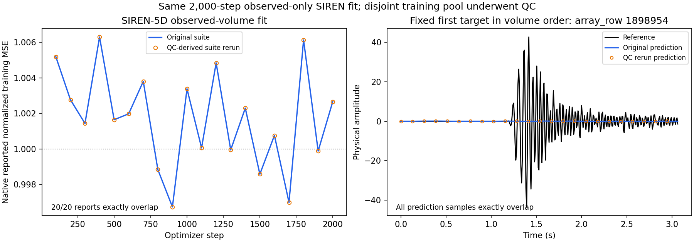

# C3 SIREN-5D：異常437本を除外したsuiteでの再実行

異常437本を除外したStudy 029 suiteで、SIREN-5Dを新規初期化から2,000ステップ
再学習した。評価対象58,999本のSNRは−0.0003 dB、RMSEは9.9390で、前回から改善しなかった。
ゼロ埋めのSNR 0.0000 dB、RMSE 9.9386とほぼ同じ精度である。

## 固定した条件と結果

前回と同じvalidation case `c3_benchmark_validation_random_trace_80_seed142`、
shape `[384, 9, 32, 8, 32]`、観測14,729本、評価対象58,999本を使用した。
評価は物理振幅で全22,655,616 target sampleを採点する。
モデルは6座標特徴・幅256・4隠れ層・199,425パラメータ、omegaは各層30、
Adam・学習率0.0001・batch 16,384・seed 20260908・2,000更新である。
GPU `cuda:1`、prediction batch 65,536、thread数1も維持した。

| 指標 | 前回・Study 027 suite | 今回・QC後suite |
|---|---:|---:|
| 評価対象SNR（dB） | −0.0003 | −0.0003 |
| 評価対象RMSE | 9.9390 | 9.9390 |
| 観測点のモデルRMSE（観測振幅の再挿入前） | 9.9415 | 9.9415 |
| 観測振幅の再挿入後の最大誤差 | 0.0000 | 0.0000 |
| 最終batchの正規化MSE | 0.9936 | 0.9936 |
| SIRENの観測振幅RMS | 9.9412 | 9.9412 |
| 未予測の評価対象本数 | 0 | 0 |

表は小数4桁へ丸めている。SNRの保存値は両方とも
`-0.0003001862856955029`、RMSEは`9.938953479476723`、
SIRENのRMSは`9.941172801367607`である。

## QCでSIRENの精度が変わらなかった理由

除外した437本はすべてtrain partitionのFFID 1746にある。
このSIRENは、補間対象validation cropの観測点だけを使って、そのvolume専用に学習する。
train partition全体を使うGNNとは学習入力が異なる。

SIRENの正規化尺度は観測14,729本×384 sampleから計算するvolume内RMSであり、
GNNで修正したtrain全体のRMS（28.6279）を使用しない。
今回のsource QCによってSIRENが読む波形や座標、観測mask、正規化尺度は変わらない。
新suiteに接続して再学習しても、SIRENの最適化問題は前回と同じである。

また観測点の再挿入前RMSEが観測振幅RMSとほぼ同じで、学習損失も約1のままである。
これは今回の構成と2,000更新では、観測波形自体を十分に学習できていないことを示す。
437本の除外だけではこの学習不足は解消しなかった。座標表現、周波数設定、モデル容量、
学習予算のどれが支配的かは、この同条件の再実行だけでは特定できない。

## 入力・出力の照合

独立した入力監査で、新旧の観測波形、正規化後振幅、座標、mask、row対応の
全12配列がビット単位で一致した。train poolは1,146,803本から1,146,366本へ減少し、
除外437本と今回の観測点・評価対象・crop全体との重複はいずれも0本だった。

出力監査では全28,311,552 prediction sampleが有限で、新旧の差分は全要素0だった。
最終checkpointの全10 state tensor・199,425パラメータも一致し、predictionファイルと
checkpointファイルのSHA256もそれぞれ同一だった。全20回の学習損失記録も一致した。
両方の保存予測を新suiteの同一評価対象で再採点し、保存された指標と完全一致することを確認した。

採用した[比較記録](../results/study_029_c3_amplitude_qc/20260909T001042536335Z_1819109f28e1_siren_comparison/siren_comparison.json)、
[入力監査](../results/study_029_c3_amplitude_qc/20260909T001042536335Z_1819109f28e1_siren_comparison/siren_input_audit.json)、
[manifest](../results/study_029_c3_amplitude_qc/20260909T001042536335Z_1819109f28e1_siren_comparison/manifest.json)
に元runとファイルhashを記録した。



右図はvolume順で最初の評価対象trace（`array_row=1898954`）を描いたもので、
精度を見て選んだ例ではない。左図の損失も右図の予測も新旧で重なっている。

## 再現条件と保存先

実行条件は[siren_rerun.yaml](../studies/study_029_c3_amplitude_qc/siren_rerun.yaml)、
入力固定は[siren_rerun_inputs.yaml](../studies/study_029_c3_amplitude_qc/siren_rerun_inputs.yaml)。
SIRENの設定断片は前回のファイルをそのまま参照し、SHA256は
`b8b3368d1ecf42ebec613dff2ce87ba0b8fa05a9aa631048fa8694aeb5496fa6`。
QC後suiteのSHA256は
`f707a2e09dc0c0c2e137c1c2aef3ed57ade7bf8a3f05e9b784f531d70ed3a3ee`。

```bash
python scripts/run_c3_first_results.py \
  --config studies/study_029_c3_amplitude_qc/siren_rerun.yaml \
  --inputs studies/study_029_c3_amplitude_qc/siren_rerun_inputs.yaml \
  --action siren --execute
```

- 今回run：`runs/study_029_c3_amplitude_qc/20260909T000855786328Z_1819109f28e1_siren/`
- 前回run：`runs/study_028_c3_first_results/20260908T140522881249Z_edda0ae6aa06_siren/`

今回のrunは15.4071秒で完了し、学習4.0885秒、予測0.8827秒、GPU最大割当259.0166 MiB。
共有GPU上の経過時間であり、QCによる高速化の証拠とは扱わない。
前回のcheckpointを読み込まず、固定seedで新規学習し、最終checkpointと全volume予測を保存した。
本番runにはGit SHAと`git_worktree_dirty: true`が保存されている。
SHAは実行時の基点であり、直前のQC実装を含む未commitのworkspace上で実行した記録である。

元SEG-Y追跡、除外方針とGNNの数値診断は
[QC報告書](c3_amplitude_qc_20260908.md)を参照する。
実行した静的検査とSIREN・bridgeの対象テストの正確なコマンド・結果は
[検証記録](../runs/study_029_c3_amplitude_qc/20260909T001155425501Z_1819109f28e1_siren_rerun_checks/checks.md)
に保存した。
