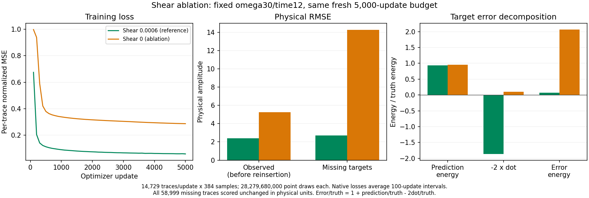

# C3 SIREN の shear 除去比較 — 2026-09-09

**共通条件の主比較は shear 0・omega 30・time scale 12 の target SNR −3.1486 dB、RMSE 14.2809 で、10 dB 目標は未達である。** shear 付きの 11.3422 dB、RMSE 2.6929 は、[補助変換付きの SIREN 診断結果](c3_siren_coordinate_investigation_20260909.md)として保持し、主比較から除外する。以前の採用維持という判断は共通条件では撤回済みである。

比較では omega 30・time scale 12 を保ち、shear だけを 0 にすると精度が悪化した。この設定・同じ seed・5,000 更新で固定 shear が有効だったという診断は変わらない。ただし、観測だけから係数を求めることによる漏洩回避と、他手法との公平な比較条件は別である。SIREN だけの補助変換を主比較には認めず、他手法へ shear を自動導入することもしない。

固定 QC validation case `c3_benchmark_validation_random_trace_80_seed142` の観測 14,729 本を各更新で全て使った。両条件とも seed 20260908 で新規初期化し、チェックポイントから継続せず 5,000 更新を完了した。幅 256・隠れ層 4、初層／隠れ層 omega 30、time scale 12、一定学習率 10⁻⁴ の Adam、microbatch 262,144 points、per-trace RMS 正規化は共通。各トレースは 384 samples、累積 point 数は両方 **28,279,680,000** である。

設定差は、時間座標の元となる `τ = t + 0.0006 × relative_receiver_y` を `τ = t` にした点だけである。時刻は秒、距離は m。波形をずらしたり、評価窓を変更したりしていない。係数 0.0006 s/m は観測だけの事前診断から決めたもので、target から推定していない。

| 条件 | 学習観測 RMSE（再挿入前） | target RMSE | target SNR (dB) | 学習時間 (s) | 全体時間 (s) |
| --- | ---: | ---: | ---: | ---: | ---: |
| shear 0.0006（補助変換付き診断） | 2.3861 | 2.6929 | 11.3422 | 1,179.5277 | 1,216.6931 |
| **shear 0（現在の主比較）** | **5.2413** | **14.2809** | **−3.1486** | **1,112.7451** | **1,140.3644** |

target は **58,999 本 × 384 = 22,655,616 samples** の全欠測対象で、保存済み予測を CPU・float64 で独立再計算し、両条件とも元の指標と完全一致した。学習観測 RMSE は、観測値を出力へ再挿入する前のモデル出力について元 run が記録した値であり、target RMSE とは領域が異なる。時間は共有 GPU 上の実測記録で、速度差の一般的な結論には使わない。[全精度の比較 CSV](../results/study_031_c3_siren_10db/20260909T031103662283Z_1819109f28e1_shear_ablation_comparison/shear_ablation.csv)。

図は診断時点の出力を保持しており、図中の reference は shear 付き診断条件を指す。左は per-trace 正規化後の MSE の 100 更新区間平均、中央は観測と target の物理 RMSE、右は正解エネルギーで割った target の誤差成分である。shear 0 では観測への適合も target 精度も悪化した。[学習曲線の数値 CSV](../results/study_031_c3_siren_10db/20260909T031103662283Z_1819109f28e1_shear_ablation_comparison/training_loss.csv)。

| 条件 | 予測 RMS | 予測エネルギー / 10⁹ | 正解・予測の内積 / 10⁹ | uncentered cosine | 誤差エネルギー / 10⁹ |
| --- | ---: | ---: | ---: | ---: | ---: |
| shear 0.0006 | 9.6059 | 2.0905 | 2.0820 | 0.9626 | 0.1643 |
| shear 0 | 9.7326 | 2.1460 | −0.1183 | −0.0540 | 4.6205 |

正解 RMS は両条件とも 9.9386、正解エネルギーは 2.2378 × 10⁹。uncentered cosine は平均を引かない内積を両者のノルムで割った値で、Pearson 相関ではない。shear 0 でも予測振幅の大きさは近いが、target 波形全体の一致が大きく低下した。

`Eerror = Etruth + Eprediction − 2 × dot(truth, prediction)` で分解すると、shear 除去による予測エネルギー増加は 0.0555 × 10⁹ に対し、内積の 2 倍の減少は 4.4007 × 10⁹ で、誤差エネルギーは 4.4562 × 10⁹ 増えた。直接計算した誤差エネルギーと恒等式との差は両条件 approximately 0。正解に合わせた予測の再スケーリングは行っていない。

入力ハッシュ・行 ID・保存済み尺度ベクトルは完全一致し、全予測は有限、観測再挿入後の最大差は厳密に 0 だった。学習と RMS 尺度推定・補間は観測だけを使用し、欠測 target 波形は評価にのみ使用した。別の test partition は未使用である。[比較・監査要約 JSON](../results/study_031_c3_siren_10db/20260909T031103662283Z_1819109f28e1_shear_ablation_comparison/shear_ablation.json)。

この比較は、宣言した設定・同じ seed・5,000 更新で固定 shear が有効だったことを示す。shear 0 の波形を SIREN が原理的に表現できないことや、別の初期化・学習予算でも同じ結果になることまでは示していない。

shear 0 の元 run は `20260909T030400486453Z_1819109f28e1_siren`。compact JSON・CSV・PNG は診断成果として保持し、重みと大配列も元の `runs/` から変更しない。[診断 manifest](../results/study_031_c3_siren_10db/20260909T031103662283Z_1819109f28e1_shear_ablation_comparison/manifest.json) の数値・出典は維持する。11.3422 dB の [旧採用 manifest](../results/study_031_c3_siren_10db/20260909T023636913643Z_1819109f28e1_final_coordinate_comparison/manifest.json) に残る `model_adopted`・`goal_achieved` は過去の判断で、後続の採用見直しにより共通条件では撤回済みである。現在の分類は [比較条件・採用見直し記録](../results/study_031_c3_siren_10db/20260909T033540186900Z_1819109f28e1_comparison_contract_revision/comparison_classification.json) に従う。本文の小数は 4 桁、機械可読値は丸めず保持している。
