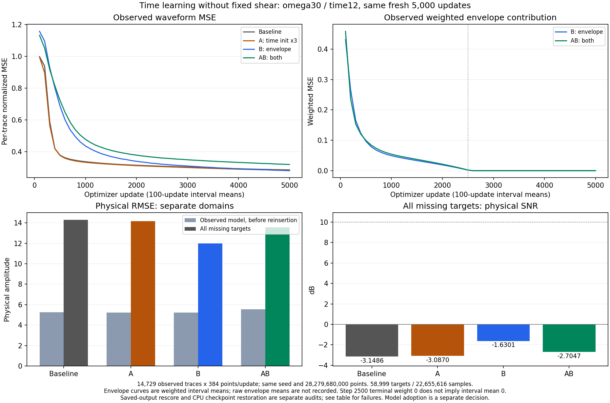

# C3 SIREN の時間方向学習比較 — 2026-09-09

**固定 shear なしの4条件では、観測 envelope 損失のみを加えた B が target SNR −1.6301 dB、RMSE 11.9903 で最も良かった。shear なしの10 dB目標は未達であり、この追加3モデルは採用しない。** 図表と元 run は診断成果として保持する。現在のSIREN採用参照は、別の [固定 shear を明記した11.3422 dBのモデル](../results/study_031_c3_siren_10db/20260909T055026000000Z_e39df16d563c_shear_reference_adoption/adoption_decision.json)であり、この4条件比較には含めない。

同じ QC validation case `c3_benchmark_validation_random_trace_80_seed142` を用い、baseline に対して A は初層の時間入力重みを初期化時だけ3倍、B は観測波形の envelope 補助損失、AB は両方を加えた。モデルは Cartesian5・幅256・4層・omega30/30・time scale12・shear0。各条件とも seed20260908 で新規初期化し、観測全14,729本×384 samples を毎更新使用して、一定学習率10⁻⁴の Adam で5,000更新を完了した。累積提示点数は各 **28,279,680,000**。各 preflight のモデルは破棄し、途中 checkpoint や品質による再試行は選択していない。[宣言した条件と判断理由](../studies/study_031_c3_siren_10db/decisions.md#2026-09-09--predeclare-three-shear-free-initialization-and-envelope-loss-conditions)。

| 条件 | target SNR (dB) | target RMSE | 学習観測 RMSE（再挿入前） | 最終 step の波形 MSE |
| --- | ---: | ---: | ---: | ---: |
| baseline | −3.1486 | 14.2809 | 5.2413 | 0.2857 |
| A: 初期時間重み3倍 | −3.0870 | 14.1799 | 5.2205 | 0.2837 |
| B: envelope | **−1.6301** | **11.9903** | 5.2220 | 0.2848 |
| AB: 両方 | −2.7047 | 13.5693 | 5.5394 | 0.3229 |

target は **58,999本×384 = 22,655,616 samples** の全欠測対象である。保存済み物理予測を CPU・float64 で独立再採点し、全条件とも元 run の指標と完全一致した。観測 RMSE は再挿入前のモデル出力について元 run が記録した物理指標、波形 MSE は per-trace 正規化後の学習指標で、互いに異なる量である。[全精度の比較 CSV](../results/study_031_c3_siren_10db/20260909T044151000000Z_1819109f28e1_time_learning_comparison/time_learning_comparison.csv)。

B/AB の envelope は観測だけから求め、Gaussian 幅は4・8 samples、係数λは最初の更新で1、step2500で0へ線形減衰し、以降は0である。図の `waveform_mse` と `weighted_envelope_mse`、記録された `train_loss` は100更新の報告区間平均で、`envelope_weight` は区間末λである。step2500ではλが0でも、直前の更新を含む重み付き項の区間平均は B が0.0020、AB が0.0022で、step2600以降は厳密に0だった。重みなし envelope MSE は独立保存せず、区間末λから逆算もしない。step5000は全条件で MSE のみだが、最終 step と最後100更新の平均は別である。例えば B はそれぞれ0.2848と0.2816となる。[学習曲線 CSV](../results/study_031_c3_siren_10db/20260909T044151000000Z_1819109f28e1_time_learning_comparison/training_loss.csv)。

| 条件 | target 予測 RMS | uncentered cosine | 学習時間 (s) | 全体時間 (s) |
| --- | ---: | ---: | ---: | ---: |
| baseline | 9.7326 | −0.0540 | 1,112.7451 | 1,140.3644 |
| A | 9.6784 | −0.0448 | 1,111.4726 | 1,147.0132 |
| B | 8.9861 | 0.2002 | 1,441.3937 | 1,469.2988 |
| AB | 9.6073 | 0.0364 | 1,146.1195 | 1,172.5711 |

正解 RMS は全条件9.9386で、同じ target の `SNR = 20 log10(RMS_truth / RMSE_target)` が成り立つ。B は baseline より1.5185 dB改善したが、全条件とも zero-fill の0 dBより低い。A の変更だけでは差が小さく、AB は B より悪かった。B の観測 RMSE は baseline と近い一方、欠測の cosine は改善した。これは平均を引かない内積を両者のノルムで割った値で、Pearson 相関ではない。

`Eerror = Etruth + Eprediction − 2 dot(truth, prediction)` の全対象検算も通った。B では baseline に対して予測エネルギーが0.3166×10⁹減り、正解との内積が0.5234×10⁹増え、誤差エネルギーは1.3634×10⁹減った。直接計算との恒等式の差は全条件 approximately 0。正解に合わせた予測の再スケーリングはしていない。入力ハッシュ・全行 ID・保存尺度は一致し、全予測は有限、観測再挿入後の最大差は厳密に0だった。学習・尺度推定と IDW 補間は観測だけを使い、target 波形は完了後の評価にのみ使用した。別の test partition は未使用である。[指標・監査要約 JSON](../results/study_031_c3_siren_10db/20260909T044151000000Z_1819109f28e1_time_learning_comparison/time_learning_comparison.json)。

通常の CPU checkpoint 復元は、事前に固定した16 target 本×384 samplesを保存 GPU 予測と比較する別監査であり、全 target の再採点とは区別する。target 真値は読まず、保存尺度と重みから復元した。事前の工学的閾値は physical relative L2・正規化差 RMSE が各0.005以下、正規化差最大値が0.02以下で、結果後に変更していない。

| 条件 | physical relative L2 | 正規化差 RMSE | 正規化差最大値 | CPU 復元監査 |
| --- | ---: | ---: | ---: | --- |
| baseline | — | — | — | 未実施 |
| A | 0.0062 | 0.0058 | 0.0905 | 3基準で閾値未達 |
| B | 0.0046 | 0.0044 | 0.0795 | 最大値のみ閾値未達 |
| AB | 0.0046 | 0.0046 | 0.0889 | 最大値のみ閾値未達 |

A の追加数値診断では、元の GPU `high` モードと元の予測 batch 配置を再現すると、同じ16 target の保存予測と bitwise 一致した。`highest` モードでは CPU 復元と近く、保存予測に対する閾値未達を再現した。また `high` で小さい batch 配置にまとめると保存予測との差が大きくなり、physical relative L2 は0.2936だった。`highest` では両 batch 配置が一致した。この部分検証は A の数値モード・batch 形状への依存を示すが、元の CPU 失敗を取り消さず、全 target の checkpoint 復元を保証するものでもない。B/AB については同じ原因と断定しない。元の [A 追加診断](../runs/study_031_c3_siren_10db/20260909T050058176083Z_1819109f28e1_time_init3_gpu_restoration_audit/result.json)と各監査の出典は manifest に保持する。

結論の範囲は1 seed・固定 validation・5,000更新である。envelope が有効な更新は682本×384 = 261,888点の完全トレース microbatch を使い、MSE のみの経路は従来の262,144点上限を使うため、損失項以外に batch 境界と加算順も変わる。数学的な損失の効果だけを完全に分離した実験ではなく、SIREN の表現能力や学習予算全般の限界も結論しない。時間は共有 GPU での実測値で、一般的な速度優劣を示さない。

compact JSON・CSV・PNG は元解析 run から byte-identical に採用し、重みと大きな予測配列は元の `runs/` に保持する。[診断 manifest](../results/study_031_c3_siren_10db/20260909T044151000000Z_1819109f28e1_time_learning_comparison/manifest.json)は4条件の元 run、各監査・数値診断・実装検証記録のパスと SHA256 を記録する。この4条件についての `model_adopted=false`、`goal_achieved=false`は維持し、別条件の参照モデル採用とは区別する。本文の数値は小数4桁、機械可読値は丸めず保持している。
