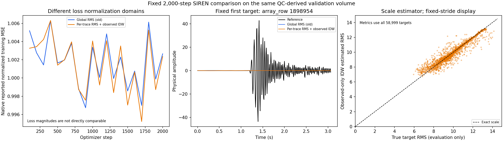

# C3 SIREN：per-trace正規化と欠測位置のスケール内挿

観測traceごとのRMS正規化と、観測側のRMSから欠測位置の尺度を内挿する処理を実装した。
異常437本を除外済みのsuiteで、前回と同じ2,000更新のSIRENを新規学習した。
物理振幅でのSNRは−0.0002 dB、RMSEは9.9389となり、実質的な精度改善はなかった。
一方、尺度内挿の相対絶対誤差の中央値は1.9647%であり、今回の大きな波形誤差は
尺度の推定誤差だけでは説明できない。観測波形の学習不足が残っている。

## 過去studyから採用した点

[Study 013](../studies/study_013_amplitude_balancing/README.md)では、ランダム点の小batchで
per-trace RMSだけを導入しても近ゼロ予測のままだった。
[Study 014](../studies/study_014_full_trace_batch_ablation/README.md)では、全435本の完全波形を
各更新で使う条件により、学習領域のmedian trace S/Nがglobal RMSの8.9100 dBから
per-trace RMSの16.1400 dBへ改善した。これは50,000更新での学習領域の結果であり、
今回の欠測位置に対する物理SNRとは評価条件が異なる。

Study 017–021のoracle unit-RMS評価では、正解波形自身の尺度を使って波形形状を評価していた。
今回の復元には観測側から推定した尺度を使い、予測時に利用できる情報で物理振幅を求めた。
正規化と復元尺度の変更を検証するため、モデル・sampler・batch・seed・更新数は前回と固定した。
全波形をまとめたbatchへの変更は今回の比較には含まれない。

## 観測情報だけによる正規化と復元

観測14,729本それぞれについて、選択した384 sampleのRMSをfloat64で計算し、その値で割る。
RMSが0のtraceは、正規化波形0・物理尺度0として保持する。この実volumeの観測側には
ゼロ尺度のtraceはなかったが、ゼロ保持はsynthetic testで検証した。

欠測58,999本の尺度は、観測側の近傍8本から距離の逆二乗による加重平均で求めた。
距離はsource X/Y・relative receiver X/Yを`[160,80,40,40] m`で割った4次元空間で計算する。
各軸の尺度は取得格子から定めたもので、評価波形に対してfitしていない。
同距離の候補は元の`array_row`の順序で選び、観測位置には自身の実測RMSを適用する。

予測した正規化波形へ、その位置の尺度を1回掛けて物理振幅に戻し、観測値を再挿入した。
欠測波形の真値・真値のRMS・予測波形自身のRMSは、学習や復元尺度の算出に使っていない。
真値のRMSは学習完了後の尺度誤差の評価だけに使用した。

異常437本はQCによって除外済みで、今回の観測入力と内挿候補に含まれない。
対象crop、mask、元波形は前回と同じであり、nativeの入力lockも一致した。

## 実測結果

全58,999 target trace・22,655,616 sampleを物理振幅で再採点した。
予測全28,311,552 sampleは有限で、観測値の再挿入後の誤差は0だった。

| 方式 | target SNR（dB） | target RMSE | 観測点のモデルRMSE・再挿入前 |
|---|---:|---:|---:|
| 前回：volume内global RMS | −0.0003 | 9.9390 | 9.9415 |
| 今回：per-trace RMS＋観測側IDW | −0.0002 | 9.9389 | 9.9414 |
| ゼロ埋め | 0.0000 | 9.9386 | — |

表は小数4桁へ丸めている。今回の保存値はSNR `-0.00022983263214371163` dB、
RMSE `9.938872976628174`。正規化MSEの最終batch lossは0.9971で、学習中も約1に留まった。
global RMSとper-trace RMSでは損失の正規化単位が異なるため、損失値の大小を直接比較しない。

尺度だけを全評価対象で比較すると、RMS推定のRMSEは0.5290、relative L2は5.3229%、
`abs(推定RMS−真値RMS)/真値RMS`の中央値は1.9647%だった。
真値RMSが0の評価対象は0本。真値RMSの範囲は5.4837–14.4995、
内挿RMSの範囲は6.4935–13.3676であり、極端な尺度には平滑化による偏りもある。

中央の波形はvolume順で最初の評価対象`array_row=1898954`を固定して描いた。
右の散布図は32本おきの固定間引き表示で、尺度誤差の数値は全58,999本から求めた。
観測点自体のモデルRMSEも観測振幅RMSとほぼ同じで、波形を十分に学習できていない。
過去Study 014を踏まえると、完全波形を単位とするbatch構成は次に調べる根拠があるが、
今回の大きなvolumeでも改善することはまだ確認していない。

## 保存先と検証

条件は[Study 030](../studies/study_030_c3_siren_trace_scaling/README.md)、
suite SHA256は`f707a2e09dc0c0c2e137c1c2aef3ed57ade7bf8a3f05e9b784f531d70ed3a3ee`。
実行は`runs/study_030_c3_siren_trace_scaling/20260909T003230820286Z_1819109f28e1_siren/`に保存した。
新規初期化からの学習4.1240秒、観測データと尺度の準備15.0040秒、予測0.9251秒、
外側の実行全体30.4454秒で完了した。

checkpointには73,728個の物理尺度、対応する元row IDとIDW条件を保存した。
保存尺度とcheckpointの値・volume行順・観測側実測RMSの一致を確認した。
synthetic testでは欠測真値の変更に対する学習・尺度の不変性、尺度と行順の不正入力拒否、
checkpoint再読込後の物理予測一致、従来global RMSの振る舞いを確認した。
本番の保存予測から再計算した全対象指標もnative記録と完全一致した。

採用した[比較JSON](../results/study_030_c3_siren_trace_scaling/20260909T002931981144Z_1819109f28e1_siren_output_audit/siren_trace_scaling.json)、
[CSV](../results/study_030_c3_siren_trace_scaling/20260909T002931981144Z_1819109f28e1_siren_output_audit/siren_trace_scaling.csv)、
[manifest](../results/study_030_c3_siren_trace_scaling/20260909T002931981144Z_1819109f28e1_siren_output_audit/manifest.json)
に元runとsource hashを記録した。正確な静的検査・対象テストのコマンドと結果は
[検証記録](../runs/study_030_c3_siren_trace_scaling/20260909T003323912239Z_1819109f28e1_implementation_checks/checks.md)
に保存した。

実行時のGit SHAは未commitの変更を含むworkspaceの基点であり、runに
`git_worktree_dirty: true`を記録している。旧run・旧checkpoint・固定suiteを上書きしていない。
